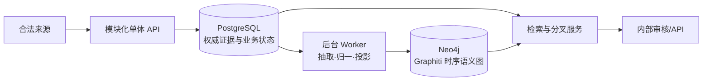
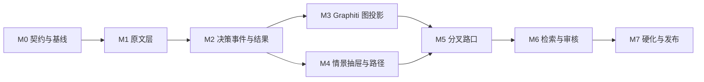

# 决策情景知识库实施计划

> 计划版本：1.0
>
> 日期：2026-08-20
>
> 当前状态：`IN_PROGRESS`，已完成契约、原文幂等入库、本地双端工作台、知乎搜索—问题采集、质量门和滚雪球候选纵向切片
> 第一版定义：可在授权试点数据上持续运行、可追溯、可更新、可删除、可审核的完整闭环；不是只有演示数据的聊天原型。

> 模型校正（2026-08-21）：真实回答调查表明，不能强制每条回答生成完整 `DecisionEpisode`。
> 先做回答级分型和可选 `KnowledgeFragment`；只有能证明事件边界的片段才组合成经历，无法总结的回答保留为来源并标记 `NO_UNIT`。
> 详细样本与最小表结构见 [docs/knowledge-base-model.md](./docs/knowledge-base-model.md)。

> 主轴校正（2026-08-22）：一级归类改为 `DecisionObject`。知乎问题标题负责回答“用户正在决定什么”，规范说法决定对象身份，COEL 只作上位语义锚点；回答正文作为对象下的案例与证据。原有情景/分叉链路降为二级案例分析和实验基线。
> 当前主轴采用无人审核的失败关闭流程：结构、置信度、批次防塌缩或 COEL 别名校验任一失败就自动排除，不进入正式 `DecisionObject`。下文保留的人工审核里程碑属于旧情景/分叉方案，不是当前一级归类依赖。

## 1. 一句话目标

把知乎问题凝练为统一的决策对象，把合法取得的回答保留为该对象下有原文证据的案例；查询时先进入同一对象，再按用户完整情景排序案例。

事实数据层到“路口”结束；如需给用户建议，另建只读的决策支持层，消费已审核的情景、分叉和结果证据，不反写事实库。

## 2. 五个词说清系统

| 口语模型 | 领域对象 | 系统职责 |
|---|---|---|
| 原文 | `ContentSnapshot + EvidenceSpan` | 保存来源版本和支持结论的具体片段 |
| 片段 | `KnowledgeFragment` | 保存可定位、可分类的语义材料；可以没有完整决策结构 |
| 决策事件 | `DecisionEpisode` | 表达一次“决策背景—决策情景—决策结果” |
| 抽屉 | `CanonicalScenario` | 合并前置状态和决策点相近的事件 |
| 路口 | `BranchPoint` | 同一抽屉下出现至少两种有证据的行动路径 |

这五层不是每条回答都必须走完：没有原文证据就没有正式片段；没有可比较经历就没有正式抽屉；没有不同选择及后续就没有正式路口。

## 3. 第一版完成定义

第一版只有同时满足以下条件才算完成：

- 合法导入、人工提交和已授权 Adapter 走同一个 `SourceRecordV1` 契约；无授权时自动知乎任务无法启动。
- 相同内容重放不重复；回答编辑产生新快照；删除或不可访问事件能撤回相应支持。
- 一篇回答可以产生 0..N 个决策事件，每个正式主张都能定位到同一快照中的证据片段。
- PostgreSQL 保存原文、证据、版本、审核和业务状态，是唯一权威数据源。
- 关系库保存正式知识；Graphiti + Neo4j 只作为可重建的派生图投影，不是第一版的事实源或阻塞条件。
- 相似情景可以增量归类；同一叙事中有明确时间依据的经历可以组成路径。
- 系统能识别候选分叉，区分“不同选择”和“相同行动下的结果分化”。
- 正式分叉经过人工审核；系统不展示成功概率，不声称相关关系是因果关系。
- 具备检索、审核、失败重试、监控、备份恢复、全图重建和删除演练。

## 4. 冻结的架构



第一版只保留四个运行单元：

1. 一个 Python 模块化单体 API；
2. 一个后台 Worker，同一代码库、不同进程；
3. 一个 PostgreSQL；
4. 一个 Neo4j，由 Graphiti 访问。

任务队列先使用 PostgreSQL 状态表和行锁，不引入 Kafka、Airflow 或另一套队列系统。只有基准证明数据库队列成为瓶颈，才允许增加新组件。

### 4.1 技术基线

| 层 | 第一版基线 | 约束 |
|---|---|---|
| 运行时 | Python 3.12 | API、Worker 和 Graphiti 统一语言 |
| API | FastAPI + Pydantic 2 | 请求和领域契约共用 schema |
| 权威库 | PostgreSQL 18 + pgvector 0.8.6 | 关系、证据、全文、向量和任务状态 |
| 迁移 | Alembic | 所有 schema 变更可前进、可回退或有恢复说明 |
| 图引擎 | `graphiti-core==0.29.3` 起步 | 完成技术验证后锁定精确版本和依赖哈希 |
| 图存储 | Neo4j 5.26 Community 单库 | 固定一个语料 `group_id`；第一版不用 FalkorDB 多 group |
| 测试 | pytest | 契约、单元、集成、黄金集、恢复和性能测试 |
| 本地部署 | Docker Compose | 新环境按文档一次启动 |

LLM 和 embedding 通过接口注入，不把领域代码绑定到单一供应商。进入候选的模型必须支持稳定结构化输出，并通过中文黄金集；未经评测不能直接替换生产版本。

### 4.2 权威边界

| 数据 | 权威位置 | 其他位置的性质 |
|---|---|---|
| 原始响应与内容快照 | PostgreSQL 受限 schema | 不复制到图中 |
| 脱敏正文与证据偏移 | PostgreSQL | 图中只保存必要摘要/定位键 |
| 决策主张与审核状态 | PostgreSQL | Graphiti 属性是可重建副本 |
| 实体、关系和时序图 | Graphiti/Neo4j | 可由已确认经历重建 |
| 情景、转移、分叉状态 | PostgreSQL | Neo4j 用于邻域和路径查询 |
| 向量 | PostgreSQL/pgvector | 与模型 ID、输入 hash 一起版本化 |

### 4.3 语义处理 Worker 与 Codex-Spark

语义处理采用“任务驱动、提案落库、确定性校验”的边界。GPT-5.3-Codex-Spark（如果当前 Codex 账号可用）负责快速提出结构化语义结果；它不直接连接 PostgreSQL，也不能绕过证据和审核门槛修改正式情景。

```text
processing_task → CodexSparkDriver → semantic_proposal
                → schema/证据校验 → candidate/review queue
                → 事务写入 DecisionEpisode / Scenario / Branch
```

首批任务类型：

- `classify_snapshot`：回答是否含有可抽取的决策材料；
- `extract_fragments`：提取决策背景、决策情景和结果片段；
- `compose_episode`：组合同一事件的片段；
- `build_scenario_text`：生成决策情景 embedding 的规范化文本；
- `propose_membership`：提出情景归属候选；
- `summarize_outcomes`：按时间窗口汇总结果观察。

每个提案必须保存模型 ID、提示词版本、输入 hash、证据片段 ID 和校验状态；相同输入重放必须幂等。embedding 由独立的向量模型生成，Spark 只负责生成稳定的情景文本。

由于 Codex-Spark 当前是 Codex 中的研究预览，`SemanticModelDriver` 必须可替换；当账号/运行环境不能提供 Spark 时，使用同一任务契约的 API 结构化模型，不改变数据库模型和审核流程。

成本默认分层：本地规则先过滤；`GLM-4.7-Flash` 批量处理常规分型和抽取（默认 L1）；`gpt-5.4-nano` 只处理低置信度、长文和冲突样本；Spark/强模型只用于提示词开发、黄金集复核和少量疑难案例。免费模型仍按配额/QPS 运行，Worker 必须记录 token 数、缓存命中、模型版本、限流重试和升级原因。

## 5. 数据契约与版本规则

第一版先冻结五个契约：

| 契约 | 当前版本 | 变化规则 |
|---|---|---|
| 来源输入 | `source_record.v1` | 新增可选字段可兼容；破坏性变化升 v2 |
| 决策事件 | `decision_episode.v1` | 主张结构变化必须升版本并重跑黄金集 |
| 情景定义 | `scenario.v1` | 合并/拆分创建新 `scenario_version`，不覆盖历史 |
| 图投影 | `graph_projection.v1` | 输入 hash 或映射变化触发重投影 |
| 分叉检测 | `branch_detector.v1` | 阈值和算法版本进入每条候选记录 |

版本原则：

- 原始快照只追加，不修改；
- 模型重跑创建新的 `analysis_run`，不覆盖旧输出；
- taxonomy、提示词、模型、embedding 和分叉算法都必须带版本；
- 任何正式结果都能说明“哪份原文、哪次分析、哪个词表、哪个算法”产生了它。

### 5.1 当前可运行的滚雪球切片

当前工程已经把“答案继续衍生数据”落成一条可回放的候选链，但没有越过人工审核边界：

```text
搜索词/问题 ID
  → search_v3 → 问题回答列表 → 回答详情
  → 质量门
  → discovery_run + keyword_candidate
  → 下一轮查询建议
  → decision_episode_candidate（处境/决策/行动/结果 + 句子证据）
  → 人工审核后才进入情景/分叉
```

`keyword_candidate` 保留 `content_snapshot_id`、`raw_envelope_id`、来源查询和发现轮次；
`decision_episode_candidate` 保留 `analysis_version=heuristic-v1`、字段和证据句索引。
两者都不是正式知识，重复导入只更新已有血缘，不制造重复候选。

请求传输可选 `zhurl` 或用户明确提供的本机 `--cookie-file`；Cookie 只在请求进程中使用，
不进入原始记录和数据库。

## 6. 里程碑与依赖



| 里程碑 | 周期建议 | 状态 | 被什么阻塞 |
|---|---|---|---|
| M0 契约与工程基线 | 2–3 天 | `READY` | 无 |
| M1 原文与证据底座 | 第 1 周 | `BLOCKED` | M0 |
| M2 决策事件与结果 | 第 2 周 | `BLOCKED` | M1 |
| M3 Graphiti 图投影 | 第 3 周 | `BLOCKED` | M2 |
| M4 情景抽屉与叙事路径 | 第 3–4 周 | `BLOCKED` | M2 |
| M5 分叉识别 | 第 4 周 | `BLOCKED` | M3、M4 |
| M6 检索、审核与 API | 第 5 周 | `BLOCKED` | M5 |
| M7 硬化与第一版发布 | 第 6 周 | `BLOCKED` | M6 |

### 6.1 责任角色

计划只写角色，不猜团队成员姓名。M0 退出前必须给每个角色指定一位最终负责人；同一个人可以兼任多个角色，但一个里程碑只能有一个最终负责角色。

| 角色 | 最终负责范围 | 主要里程碑 |
|---|---|---|
| 项目/领域负责人 | 范围、术语、黄金集规则、正式分叉与发布签署 | M0、M4、M5、M7 |
| 数据后端负责人 | PostgreSQL、Adapter、幂等、版本、删除和 API | M0、M1、M6 |
| 知识建模负责人 | 抽取、证据、taxonomy、情景、路径和分叉算法 | M2、M4、M5 |
| 图投影负责人 | Graphiti、Neo4j、映射、失效、删除与重建 | M3 |
| 质量/审核负责人 | 黄金集、人审规则、质量指标和发布回归 | M0、M2、M5、M7 |
| 平台/安全负责人 | CI、部署、监控、备份、权限、审计和许可证 | M0、M6、M7 |

### 6.2 工作项状态与完成定义

状态只使用四种：`READY`、`IN_PROGRESS`、`BLOCKED`、`DONE`。标记 `DONE` 前同时满足：

- 功能或迁移已合并，并有明确输入输出；
- 正常、边界和失败路径测试通过；
- 新增状态、指标和错误可观察；
- 相关契约、运行说明和数据字典已更新；
- 没有绕过本里程碑退出门；
- 若改变持久化数据，已说明迁移、重放或回滚方式。

## 7. 详细任务

### M0：契约与工程基线

目标：让后续每个模块围绕同一套输入、输出和测试数据开发。

任务：

- [ ] `M0-01` 建立单代码库目录：`contracts/ingest/evidence/analysis/graph/scenarios/branches/search/reviews/api`。
- [x] `M0-02` 将 `SourceRecordV1` 和 `DecisionEpisodeV1` 写成可执行 JSON Schema/Pydantic 模型。
- [ ] `M0-03` 为每个契约准备 valid、invalid、edge-case fixtures；敏感字段和未知值必须覆盖。
- [ ] `M0-04` 建立 Docker Compose：PostgreSQL、Neo4j、API、Worker；健康检查不依赖真实 LLM。
- [ ] `M0-05` 建立 Alembic、pytest、lint/type-check 和 CI 最小流水线。
- [ ] `M0-06` 准备黄金集 v1：只含合法、授权或虚构样本，并由人工标注经历边界、主张、证据和时间关系。
- [ ] `M0-07` 记录精确依赖版本、Graphiti/Neo4j 许可证复核结果和升级策略。

交付物：

- 可执行契约；
- 可重复启动的开发环境；
- 黄金集 v1 及数据说明；
- 架构决策记录和依赖锁文件。

退出门：

- 所有契约 fixtures 通过；
- 空环境可以按 README 启动并跑完 smoke test；
- 黄金集每条样本都有使用依据和标注状态；
- 未配置授权时，自动来源功能默认关闭。

### M1：原文与证据底座

目标：可靠保存“原文”，先解决合法性、幂等、版本、脱敏和删除。

任务：

- [ ] `M1-01` 建立 `data_source/source_authorization/ingest_job/raw_envelope/content_item`。
- [ ] `M1-02` 建立 `content_snapshot/evidence_span/source_event/engagement_observation`。
- [ ] `M1-03` 实现 JSONL/人工导入 Adapter；已授权知乎 Adapter 固定为 `search_v3 搜索 → questions/{id}/feeds 问题回答列表 → answers/{id} 回答详情`，并由 feature flag 与授权记录共同控制。
- [x] `M1-04` 实现幂等键 `(source, type, external_id, raw_sha256)` 和重复投递处理。
- [ ] `M1-05` 实现 HTML 清洗、正文标准化、hash 和字符偏移稳定化。
- [ ] `M1-06` 实现敏感信息检测、脱敏文本和受限作者 HMAC；语义层看不到原作者 ID。
- [ ] `M1-07` 实现 `AVAILABLE/UPDATED/DELETED/INACCESSIBLE` 事件和撤回任务。
- [ ] `M1-08` 为授权拒绝、重放、编辑、删除、同正文互动变化编写集成测试。

退出门：

- 同一 `SourceRecordV1` 重放 10 次仍只有一份相同快照；
- 正文不变时只新增互动观测；正文变化时新增不可变快照；
- 无有效 `authorization_ref` 的自动任务 100% 被拒绝；
- 删除事件可定位全部待撤回的经历、向量和图投影任务；
- 原始正文与脱敏正文权限隔离测试通过。

### M2：回答分型、知识片段与可选决策经历

目标：先给每条回答一个可审核的语义状态，再从有足够证据的片段组合 0..N 条决策经历；无法总结的回答正常停留在来源层。

任务：

- [ ] `M2-01` 在内容快照上增加独立的 `semantic_kind/semantic_status/narrative_mode` 状态，不污染来源可用性。
- [ ] `M2-02` 建立最小 `knowledge_fragment`，保存片段类型、原文引用、起止位置和分析版本。
- [ ] `M2-03` 实现亲历、建议、比较、转述、反事实、推广和无法判断的资格分类；允许 `NO_UNIT`。
- [ ] `M2-04` 只有能证明事件边界时才组合 `decision_episode`，处境/行动/结果字段允许未知。
- [ ] `M2-05` 确认字段必须回到同一快照的片段；未观察到的信息保持空值，不让模型补齐。
- [ ] `M2-06` 将审核、驳回、修改和“无需抽取”记录为可追溯事件。
- [ ] `M2-07` 用分层黄金集评估分型、片段边界、经历组合和误把建议当亲历的比例。
- [ ] `M2-08` 在真实样本上统计缺字段、重复字段、引用覆盖和长文多事件拆分效果。

退出门：

- `CONFIRMED` 片段和经历 100% 具有同快照可定位证据；
- 没有决策事件的回答仍可被标记 `NO_UNIT`，不会被当作失败或被强行填卡；
- 建议、转述、反事实和推广不得默认进入个人经历路径；
- 未知字段误补率不高于 1%；
- 多阶段、主体切换、反事实、短观点和没有经历的样本均有回归测试。

指标未达标时允许继续积累候选事件，但不得进入正式情景和分叉。

### M3：Graphiti 时序图投影

目标：把已确认决策事件安全投影为可查询、可删除、可重建的时序图。

任务：

- [ ] `M3-01` 固定实体：`SituationState/DecisionPoint/ActionArchetype/OutcomeObservation`。
- [ ] `M3-02` 固定关系：`FACES/CHOOSES/LEADS_TO/NEXT` 和严格 `edge_type_map`。
- [ ] `M3-03` 实现 `GraphProjectionWorker`，只接收已校验的紧凑 JSON episode。
- [ ] `M3-04` 建立 `graph_projection/graph_projection_job`，保存本地 ID、Graphiti UUID、版本、输入 hash 和状态。
- [ ] `M3-05` 对同一回答的明确先后经历传递 `previous_episode_uuids`；不确定顺序不强连。
- [ ] `M3-06` 入图后验证实体类型、关系允许列表和来源映射；异常进入隔离队列。
- [ ] `M3-07` 实现编辑重投影、episode 删除、共享事实保留和单经历重试。
- [ ] `M3-08` 实现“清空 Neo4j 后从 PostgreSQL 全量重建”的命令与校验报告。
- [ ] `M3-09` 编写同 group 并发、幂等、编辑失效、删除和重建集成测试。

退出门：

- 已投影事件 100% 保存 `decision_episode_id ↔ graphiti_episode_uuid`；
- 相同投影任务重放不产生重复正式关系；
- 不允许的 `RELATES_TO` 或通用 `Entity` 不得进入正式查询层；
- 编辑后旧事实按策略失效但历史仍可审计；
- 删除单一来源不会删除仍被其他来源支持的事实；
- 全量重建后的有效节点、关系和来源支持数与重建前一致。

### M4：情景抽屉与叙事路径

目标：把可比较事件放进同一抽屉，并只用明确证据串起单一叙事路径。

任务：

- [ ] `M4-01` 建立 `concept/action_archetype/canonical_scenario/scenario_version`。
- [ ] `M4-02` 冻结首批决策领域、人生阶段、决策点和行动词表；保留原始表达。
- [ ] `M4-03` 生成只包含“前置状态 + 决策点”的 `scenario_signature`；禁止行动和结果进入特征。
- [ ] `M4-04` 实现 blocking：领域、决策点大类和宽人生阶段明显冲突时不比较。
- [ ] `M4-05` 使用 pgvector Top-K 召回候选情景，再逐维输出 `SAME/DIFFERENT/UNCERTAIN`。
- [ ] `M4-06` 实现场景新增、加入、拒绝、拆分、合并及版本迁移记录。
- [ ] `M4-07` 建立 `narrative_path/narrative_path_episode`，只接受同一主体的明确时间边。
- [ ] `M4-08` 为结果泄漏、关键约束冲突、主体切换和不确定顺序建立回归集。

退出门：

- 同情景 pair precision 建议不低于 90%；
- 情景特征中不存在行动或结果字段；
- 重大约束冲突会拆分或进入人工审核，不被平均掩盖；
- 正式路径时间边 precision 建议不低于 95%；
- 不存在跨作者自动拼接的 `NarrativePath`。

### M5：路径模式与分叉路口

目标：高效找到真正的不同选择，并把所有分支落回独立来源证据。

任务：

- [ ] `M5-01` 建立 `canonical_transition/transition_support/path_pattern`。
- [ ] `M5-02` 按规范序列 `scenario → action → next scenario/outcome` 聚合路径模式。
- [ ] `M5-03` 实现路径 blocking、前缀 hash、向量 Top-K 和带权序列对齐，禁止全量 O(N²) 比较。
- [ ] `M5-04` 在共享情景上聚合不同 `CHOSEN ActionArchetype`，生成 `BranchCandidate`。
- [ ] `M5-05` 支持数按不同 `content_item_id` 计算，同一回答不得重复计票。
- [ ] `M5-06` 检查情景内聚、约束冲突、来源独立性、后续覆盖和时间窗可比性。
- [ ] `M5-07` 单独标记“结果分化”，不得把相同行动的不同结果称为分叉。
- [ ] `M5-08` 建立正式分叉审核：接受、拒绝、要求拆分情景、要求补证据。

默认候选门槛：

- 至少两种不同的已选择行动；
- 每种行动至少 3 个不同来源内容支持；不足时只能是候选；
- 每种行动至少存在部分后续状态或结果观察；
- 每条正式支持边都能回到证据片段。

退出门：

- 正式分叉人审 precision 建议不低于 90%；
- 结果分化误报为分叉的数量为 0；
- 分叉支持数与去重后的来源数一致；
- 任意分支能在一次查询中返回事件、快照和证据；
- 输出中没有“成功概率”“最佳选择”或未经证据支持的因果语言。

### M6：检索、审核和 API

目标：让内部使用者能找回答、找事件、看抽屉、比较路径并审核路口。

任务：

- [ ] `M6-01` 实现来源和经历的结构化过滤、全文召回、向量召回、RRF 合并与重排。
- [ ] `M6-02` 实现主方案中的写入、查询、路径比较和证据接口。
- [ ] `M6-03` 所有响应返回数据、taxonomy、analysis、detector 版本及审核状态。
- [x] `M6-04` 实现本地管理端最小审核控制台；用户端只做检索、证据阅读和已确认情景浏览，不输出推荐。
- [ ] `M6-05` 实现角色权限：原始层、脱敏证据层、语义层和审核层分离。
- [ ] `M6-06` 记录谁在何时查看敏感证据、修改事件、确认情景或审核分叉。
- [ ] `M6-07` 建立检索黄金查询和性能数据集，评测 Recall@20、nDCG@10、过滤正确率和 p95。

退出门：

- 所有正式查询结果可追溯且不泄露受限作者字段；
- 结构化过滤正确率为 100%；
- 黄金查询 Recall@20 建议不低于 85%；
- 在声明的试点数据量和硬件上，常用查询 p95 目标不高于 2 秒；
- 权限绕过、越权证据读取和审核审计测试通过。

### M7：硬化与第一版发布

目标：证明系统不仅能跑通，而且能在更新、删除、故障和升级下保持正确。

任务：

- [ ] `M7-01` 执行回答编辑、删除、不可访问、模型升级和情景拆分/合并演练。
- [ ] `M7-02` 执行 Worker 中断、重复消息、Neo4j 暂停、LLM 限流和数据库恢复演练。
- [ ] `M7-03` 验证 PostgreSQL 备份恢复和 Neo4j 从权威库重建。
- [ ] `M7-04` 建立指标和告警：队列积压、结构失败、证据失败、图投影失败、成本、延迟和审核积压。
- [ ] `M7-05` 固定发布依赖、镜像 digest、模型/提示/embedding 版本和回滚步骤。
- [ ] `M7-06` 完成数据保留、删除同步、访问审计、知乎授权和第三方许可证检查表。
- [ ] `M7-07` 编写运行手册、故障手册、数据字典、重建手册和第一版已知限制。
- [ ] `M7-08` 完成发布候选的全量回归并签署质量门。

退出门：

- M0–M6 的退出门全部通过，无豁免的 P0/P1 缺陷；
- PostgreSQL 恢复和 Neo4j 全量重建演练成功；
- 删除演练后，正文、证据、向量、图关系和分叉支持按政策一致撤回；
- 任何模型或 Graphiti 故障都不会修改权威原文和已审核历史；
- 授权、安全和许可证检查完成；
- 第一版发布说明明确数据是叙事主张，不是事实验证、因果结论或人生建议。

## 8. Graphiti 阻断式质量门

以下任一项失败，都禁止把图结果升级为正式数据：

| Gate | 必须满足 |
|---|---|
| `G-01` 权威隔离 | Graphiti 失败不会覆盖 PostgreSQL 原文、证据或审核状态 |
| `G-02` 固定 schema | 所有正式节点/关系属于允许类型；generic fallback 被隔离 |
| `G-03` ID 映射 | 每个 Graphiti episode UUID 都映射到本地 `decision_episode_id` |
| `G-04` 更新时间线 | 持续更新使用普通 `add_episode`；bulk 仅允许空图初装 |
| `G-05` 删除正确 | 单来源删除保留其他来源共同支持的事实 |
| `G-06` 并发隔离 | Neo4j 单库、固定 group 的并发回归通过 |
| `G-07` 输入有界 | 长回答先拆事件；超限 episode 拒绝或进入拆分队列 |
| `G-08` 敏感治理 | 只有脱敏 episode 可入图，检索结果再做权限过滤 |
| `G-09` 可重建 | 清空 Neo4j 后可以从 PostgreSQL 恢复相同有效图 |
| `G-10` 版本固定 | Graphiti、Neo4j、LLM、embedding 和提示版本均可追踪 |

## 9. 需求—任务—测试追踪

| 需求 | 实现里程碑 | 核心测试 |
|---|---|---|
| 上游兼容知乎/其他输入 | M0、M1 | 契约 fixtures、Adapter 契约、授权拒绝 |
| 回答转成 0..N 条数据 | M2 | 多阶段、无经历、主体切换边界测试 |
| 每条数据有原文证据 | M1、M2 | 偏移、同快照、证据支持黄金集 |
| 情景归类与版本 | M4 | 同情景 pair、冲突维度、拆分合并测试 |
| 构建单一叙事路径 | M3、M4 | 明确时间、不确定顺序、跨主体阻断 |
| 高效比较路径 | M5 | blocking/Top-K 召回、序列对齐、复杂度基准 |
| 找到分叉路口 | M5 | 不同行动、来源去重、结果分化负例 |
| 检索回答、事件和路径 | M6 | Recall@20、过滤正确率、证据回溯 |
| 编辑、删除和模型升级 | M1、M3、M7 | 新快照、事实失效、共享支持、并行分析 |
| 隐私、权限和审计 | M1、M6、M7 | 脱敏、RLS/权限、越权和审计测试 |
| Graphiti 可替换 | M3、M7 | PostgreSQL 全量重建 Neo4j |

## 10. 测试分层

| 层 | 目的 | 何时运行 |
|---|---|---|
| 契约测试 | 保证 Adapter、模型和 API 不破坏版本契约 | 每次提交 |
| 单元测试 | 规则、hash、偏移、状态机、门槛计算 | 每次提交 |
| PostgreSQL 集成测试 | 约束、事务、幂等、权限和队列 | 每次 PR |
| Graphiti/Neo4j 集成测试 | 类型、映射、时序、删除和重建 | 每次 PR |
| 黄金集评测 | 抽取、情景、路径、分叉和检索质量 | 模型/提示/词表变化时 |
| 恢复测试 | 重试、故障、备份、删除和重建 | 每周及发布前 |
| 性能测试 | 摄入吞吐、Top-K、路径、查询 p95 | 每个里程碑退出前 |
| 安全测试 | 授权门禁、敏感字段、越权和审计 | 每个发布候选 |

## 11. 执行顺序：下一批十个任务

除非新的证据推翻冻结架构，下一步严格按此顺序推进：

1. `M0-02` 落地两个 Pydantic/JSON Schema 契约；
2. `M0-03` 建立契约 fixtures；
3. `M0-04` 建立 PostgreSQL + Neo4j 开发环境；
4. `M0-05` 建立迁移和测试流水线；
5. `M0-06` 建立合法黄金集 v1；
6. `M1-01` 建采集与授权核心表；
7. `M1-02` 建快照与证据核心表；
8. `M1-04` 实现幂等写入；
9. `M1-05` 实现正文标准化与稳定偏移；
10. `M1-08` 先完成重放、编辑、删除集成测试，再进入抽取开发。

`M0-01` 可与第 1 项同时完成；其余任务不应越过依赖提前建设 UI、复杂 Agent 或大规模爬虫。

## 12. 变更控制

以下变化必须先更新本文件，再实施：

- 改变“PostgreSQL 是唯一权威源”；
- 替换 Graphiti 或 Neo4j；
- 修改 `DecisionEpisodeV1` 的核心语义；
- 允许跨作者拼接路径；
- 修改正式分叉的支持门槛或因果表述；
- 增加新的基础设施组件；
- 扩大到终端用户人生建议或推荐。

每次变更至少记录：动机、证据、影响的契约/数据、迁移方案、回滚方案和需要重跑的测试。

### 12.1 风险登记

| 风险 | 最早信号 | 预防/响应 | 负责角色 |
|---|---|---|---|
| 无法取得知乎自动采集授权 | 授权文件或范围在 M1 前仍为空 | 第一版只启用合法 JSONL、导出和人工输入；不阻塞下游建设 | 项目/领域 |
| 黄金集标注分歧大 | “同一情景/是否分叉”的双人一致率低 | 补充判例；分歧样本不进自动门槛；修订 `CONTEXT.md` | 质量/审核 |
| LLM 补齐原文未知信息 | 未知值误补率超过 1% | 强制证据、字段级验证、降低自动确认范围或更换模型 | 知识建模 |
| 情景聚类被行动/结果污染 | 同行动样本异常聚集但前置状态冲突 | 审计 signature 字段；冻结特征；拆分受污染版本 | 知识建模 |
| Graphiti 升级或缺陷破坏图 | 映射失败、generic 类型增加、重建不一致 | 锁版本、质量门、隔离队列；从 PostgreSQL 回滚重建 | 图投影 |
| 删除同步漏掉派生结果 | 被删除来源仍出现在搜索或分叉支持中 | 删除端到端测试；记录撤回 DAG；发布前执行删除演练 | 数据后端 |
| 语料存在幸存者/热门偏差 | 来源集中在高赞回答或单一决策结果 | 保存发现策略；按主题/时间/热度分层采样；展示覆盖说明 | 项目/领域 |
| 模型成本或摄入延迟不可控 | 单事件调用数、队列时间或失败率持续上升 | 限制 episode 大小；缓存不变输入；批量调度但不使用更新 bulk | 平台/安全 |
| 第一版范围膨胀 | 出现推荐 UI、Agent、多租户或新基础设施任务 | 按本节执行变更审查；移入第一版之后的 backlog | 项目/领域 |

## 13. 明确不做

- 未获授权时不做自动化知乎采集，也不研究绕过反爬。
- 不建立跨来源的可识别个人画像。
- 不把点赞数当经历真实性、结果质量或推荐权重。
- 不让 Graphiti community 自动成为规范情景。
- 不让 LLM 自动确认正式分叉。
- 不在第一版引入微服务、Kafka、Airflow、独立向量数据库或多图租户。
- 不输出成功概率、最佳路线或个体人生建议。

## 14. 计划维护规则

- `PLAN.md` 是建设执行的唯一入口；完成任务后勾选，并更新里程碑状态。
- [主方案](./知乎决策路径数据库落地方案.md)解释完整领域模型、表和算法，不在本文件重复所有字段。
- [底座选型](./知识库开源底座选型调研.md)保存 Graphiti 选择依据和风险证据。
- [领域词汇](./CONTEXT.md)是命名标准；代码、表、API 和评审都使用同一术语。
- `task_plan.md/findings.md/progress.md` 记录研究与规划过程，不作为研发 backlog。
- 每个里程碑结束时必须更新：任务状态、实际指标、未解决风险、下一里程碑依赖和验证结果。

## 15. 当前决策摘要

| 决策 | 状态 |
|---|---|
| PostgreSQL 是唯一权威证据与业务状态库 | 已冻结 |
| Graphiti + Neo4j 从第一版开始使用，但只作可重建图投影 | 已冻结 |
| `DecisionEpisode` 是最小分析单元 | 已冻结 |
| 情景特征不含行动和结果 | 已冻结 |
| 正式路径默认不跨作者 | 已冻结 |
| 正式分叉必须有证据、独立来源、不同选择、后续和人审 | 已冻结 |
| 未授权自动知乎采集默认关闭 | 已冻结 |
| 第一版只到路径与分叉，不做推荐 | 已冻结 |
| 本地双端入口：`/` 用户端、`/admin` 管理端 | 已实现（SQLite 默认，PostgreSQL/Compose 兼容） |
| 管理端不覆盖 URL、raw HTML 和抓取哈希；归档用 `DELETED` 状态 | 已冻结 |
