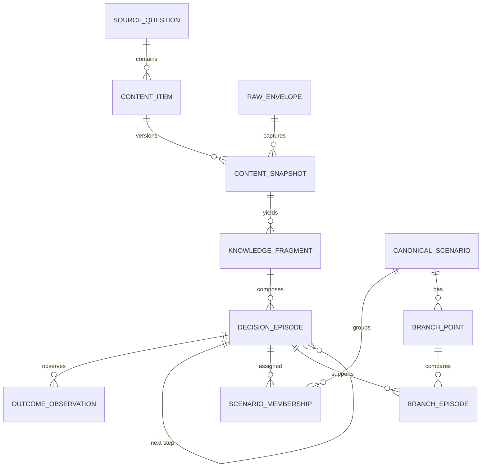

# 决策知识库数据模型

> 这份文档回答一个问题：我们要建立的不是“知乎回答列表”，而是什么样的知识库。

## 结论先说

我们的最小知识单元不是一条回答，而是：

> 一个叙述者，在一组可描述的前置状态下，面对一个决策点，采取了一种行动，并在某个观察窗口后报告了后续状态。

这个单元叫 `DecisionEpisode`（决策经历）。

知乎回答只是来源。问题标题只是来源元数据。只有把回答拆成“处境—决策点—行动—结果”，并且每个字段都能回到原文片段，才进入知识库候选层；经过审核后，才能参与情景和分叉的比较。

真正的组织主轴不是标签，而是事件关系：

```text
一篇回答
  → 一个或多个决策事件
      → 前置情景
      → 决策点与可选方向
      → 实际采取的行动
      → 后续结果观察
  → 多个事件按时间组成一条叙事路径
```

标签只用于筛选和审核队列，不能替代上述关系。

## 单条回答的三条主线

一条回答如果确实在讲一个决策，先按“前—中—后”拆，不先按标签拆：

| 主线 | 要回答的问题 | 典型内容 |
|---|---|---|
| 决策背景 | 做决定前，身处什么状态？ | 阶段、目标、资源、约束、风险、已有信息 |
| 决策情景 | 当时具体要在什么方向之间做选择？ | 决策点、选项、实际选择、行动、权衡理由 |
| 决策结果 | 选择之后观察到了什么？ | 时间窗口、事实变化、代价、收益、满意度、后悔 |

这里要区分两个“情景”概念：

- **回答内的决策情景**：这一次回答中具体发生的选择时刻，属于 `DecisionEpisode` 的中段；
- **跨回答的规范情景**：把多个背景和决策点足够相似的 `DecisionEpisode` 归并后形成的 `CanonicalScenario`。

前者是事件内容，后者是比较关系，不能混成同一个字段。

## 决策事件如何合并成规范情景

合并时只看两件事：

```text
1. 决策前是不是处在可比较的状态？
2. 当时是不是在解决同一个决策问题？
```

不要用结果来合并，也不要用标题来合并：

- **行动不同**：仍然可以属于同一规范情景，差异进入 `BranchPoint`；
- **结果不同**：仍然可以属于同一规范情景，结果留在各自的 `OutcomeObservation`；
- **背景不同或决策点不同**：即使标题相同，也不应合并；
- **只有建议、没有实际事件**：不进入亲历情景的统计，只作为建议/拟议路径证据。

第一版采用“候选召回 → 字段对齐 → 审核确认”的三步法：

1. 用“决策背景 + 决策点”做全文/向量召回，找出可能相近的已有情景；
2. 对齐少量核心字段：人生阶段、目标、关键约束、决策点、选项集合；
3. 给出合并理由和置信度，由审核者确认合并、拆分或保持未归类。

可以先用一个简单的三档门槛，不让模型直接改写情景：

```text
高匹配：核心背景和决策点都一致 → 进入同一情景的待确认队列
中匹配：有相似处但存在缺口 → 人工比较原文
低匹配：核心状态或决策点不一致 → 新建情景或暂不归类
```

合并后保存的不是一个“标签”，而是一条可撤回的关系：

```text
ScenarioMembership
  episode_id
  scenario_id
  matched_fields      # 为什么认为相似
  confidence
  review_status
  evidence_fragment_ids
```

情景摘要只描述共同起点和共同决策点，不替成员回答补充不存在的事实。合并、拆分和情景摘要重写都创建新版本，旧的归属关系保留。

## Embedding 应该嵌入什么

真正需要向量化的是**决策情景表示**，不是整篇回答，也不是标签：

```text
决策背景 + 决策点 + 已知选项 + 关键目标/约束
```

建议使用固定模板生成 `scenario_text`：

```text
背景：工作三年，当前岗位成长停滞，有六个月现金储备。
决策点：继续大厂边缘岗位，还是转到小公司核心岗位？
目标/约束：希望积累完整项目经验；需要保持现金流可承受。
```

情景匹配的 embedding **不放入**：

- 最终选择的行动（它用于形成分叉）；
- 选择之后的结果（它用于结果比较）；
- 回答标题、营销文本、无关故事和大段修辞。

否则向量会把“走了哪条路”或“结果好不好”误当成“是不是同一个起点”，导致情景合并错误。

第一版只需要三类向量：

| 向量 | 用途 |
|---|---|
| `episode_scenario_embedding` | 把新决策事件召回相似规范情景 |
| `scenario_embedding` | 搜索已经确认的规范情景 |
| `query_embedding` | 把用户当前背景和决策点转成同一格式进行检索 |

分叉和结果向量先不做；确实出现“按行动找路径”或“按结果找案例”的需求后再增加。每个向量必须记录 `model_id`、`embedding_version`、输入文本 hash 和生成时间，模型更换时可重建，不能覆盖旧向量。

向量只负责**候选召回**，不负责直接合并：

```text
pgvector Top-K 召回
  → 结构化字段阻断（阶段/目标/关键约束）
  → 字段对齐和证据检查
  → 人工确认 ScenarioMembership
```

相似度高只能说明“值得比较”，不能证明“就是同一情景”。关系库中的情景归属和原文证据仍然是权威。

### 当前实现的候选召回层

当前工程先把上述流程落在 `decision_episode_candidate` 上：

- `scenario-text-v2` 只规范化“背景 + 决策点”，并拒绝背景与决策点完全重复的候选；
- `blocking_key` 只做职业、教育、财务住房、家庭关系、健康生活等粗粒度阻断，不是正式标签；
- `candidate_embedding` 保存候选 ID、模型 ID、embedding 版本、情景文本版本、输入 hash、维度、float32 编码和向量；
- `POST /api/retrieval/candidates` 只返回 Top-K 候选及来源定位，不创建情景、不确认分叉；
- 模型重跑使用新 `embedding_version`，相同候选和版本重复导入必须幂等，输入或向量变化不得静默覆盖。

当前本地工作库已导入 6,263 条 `bge-large-zh-v1.5:scenario-text-v2` 向量。它们仍属于候选层，下一步要经过关键约束对齐、证据检查和人工审核，才能形成 `ScenarioMembership`。

## 数据处理由什么驱动

GPT-5.3-Codex-Spark 适合做快速的语义协作，但不应该直接拥有数据库写权限。数据处理采用“任务驱动 + 提案写入”模式：

```text
processing_task（待处理任务）
  → 批次打包器
  → CodexSparkDriver
  → 结构化语义提案
  → 确定性校验器
  → 候选/审核队列
  → 事务写入正式数据
```

Spark 可以负责这些语义任务：

1. `classify_snapshot`：判断回答是否有可用决策材料；
2. `extract_fragments`：切出背景、决策情景和结果的原文片段；
3. `compose_episode`：把同一事件的片段组合成 `DecisionEpisode`；
4. `build_scenario_text`：生成用于 embedding 的规范化“背景 + 决策点 + 约束”文本；
5. `propose_membership`：提出事件可能属于哪个规范情景；
6. `summarize_outcomes`：按时间窗口汇总结果观察，但不得编造因果。

每个模型提案必须带上：

```text
task_id
model_id / prompt_version
input_snapshot_ids / input_hash
output_json
evidence_fragment_ids
validation_status
```

写入门槛固定为：

- 输出通过 JSON/Pydantic schema 校验；
- 每个字段的引用片段确实存在于对应快照；
- 原文引用、偏移和 hash 能复核；
- 同一任务按 `input_hash + prompt_version + model_id` 重放不产生重复；
- 情景归属、正式分叉和结果汇总仍需审核，不由模型单方面确认。

Spark 负责“提出结构化理解”，不负责“决定数据库事实”。它也不直接生成情景向量：Spark 先生成稳定的 `scenario_text`，再由独立的 embedding 模型生成向量。

由于 Codex-Spark 当前是 Codex 中的研究预览，驱动层必须保持可替换：

```text
SemanticModelDriver
  ├─ CodexSparkDriver（可用时启用）
  └─ ApiStructuredDriver（后台无人值守时的替代实现）
```

两种驱动共用同一输入任务和输出契约，数据库不依赖某一个模型的会话状态。

### 成本分层

巨量数据不应该全部使用同一个高能力模型，默认按以下层级处理：

```text
L0 本地规则/解析       → 过滤空文本、广告、重复、无决策信号
L1 GLM-4.7-Flash       → 批量分型、片段抽取、简单三段式结构化（默认）
L2 GPT-5.4 nano         → 低置信度、长文、多事件、字段冲突的少量重试
L3 Codex-Spark/强模型   → 提示词调试、黄金集复核、极少量疑难样本
```

成本控制优先级：

1. 不把 HTML 和整篇无关正文送给模型，只送清洗后的有界文本；
2. 先用本地规则和 embedding 过滤，再调用语言模型；
3. 输入 hash 相同的任务直接读缓存，不重复调用；
4. 输出固定为短 JSON，不让模型生成长解释；
5. 大规模离线任务使用 Batch 能力，交互审核才使用 Spark；
6. 只有低置信度或规则/模型冲突时才升级模型；
7. 免费模型也要记录配额、限流、重试和积压，不能假设无限吞吐。

GLM-4.7-Flash 当前官方标价为免费，适合承担绝大多数高频结构化任务；“免费”不等于没有配额、QPS 或排队限制，实际成本仍需统计失败重试、embedding、存储和人工审核。以 10,000 条回答做全量处理前，先用 200–500 条黄金集校验结构正确率、证据覆盖率和升级比例，再锁定批量参数。

## 大量数据如何变成可检索的决策证据

数据库不负责生成“你应该选 A”的事实。它只把一万条回答压缩成可比较的证据，并在查询时找出与当前决策情景最相似的已审核记录；应用层可以再基于这些记录生成带证据的回答：

```text
10,000 条回答
  → 决策事件
  → 规范情景
  → 情景内分叉
  → 分叉的结果观察汇总
  → 当前决策情景向量
  → 相似规范情景 / 分叉 / 原文证据
```

### 查询流程

用户输入也按三段组织：

```text
当前背景：我现在处在什么状态？
决策情景：我正在考虑什么选择？
关注结果：我最在意什么代价或结果？
```

系统随后：

1. 用“当前背景 + 决策点 + 关键约束/目标”生成查询向量；
2. 召回候选规范情景，并过滤主体、阶段、关键约束明显不一致的事件；
3. 在同一情景内按实际行动读取分叉；
4. 返回相似度、匹配字段、结果观察和原文证据链接；
5. 没有足够可比证据时，明确返回空结果和缺失变量。

### 检索结果应该是什么

第一版输出“匹配结果”，不是答案或推荐：

```text
匹配的规范情景
  相似度
  匹配的背景 / 决策点 / 约束
  不匹配或未知的变量

分叉 A：实际走过这条路的事件
  行动
  结果观察
  证据回答与原文 HTML

分叉 B：同上
```

知识库不生成事实性建议、不计算成功概率，也不把相关性改写成因果结论；应用层若生成回答，只能引用检索结果，并明确证据不足和不确定性。

### 大数据有效性的四个门槛

- **可比性**：背景和决策点是否真的相近；
- **证据量**：是否有多个独立回答，而不是同一内容的重复快照；
- **结果完整度**：是否有明确观察窗口，还是只有观点和建议；
- **冲突透明**：不同结果和反例是否被保留，而不是只展示最顺眼的路径。

数据不足时，系统应返回“没有足够可比证据”和缺失变量，而不是用相似但不相关的回答凑结果。

这层只消费已经审核的 `DecisionEpisode / CanonicalScenario / BranchPoint`，不修改来源事实。检索结果可以缓存，回答也可以缓存，但必须带检索条件、数据版本和证据 ID，便于复核；生成的回答不得写回事实表。

## 组织原则：一条记录究竟是什么

第一版不把“回答”直接当成一条知识，也不把“标签”当成情景。真正的最小可比较记录是一个**决策事件**：

```text
同一个主体
  在什么状态下
  遇到了什么决策点
  当时有哪些方向
  实际走了哪条（如果确实走了）
  后来观察到了什么
```

因此数据库的主关系应该是：

| 层 | 存什么 | 作用 | 是否可以没有 |
|---|---|---|---|
| 来源 | 回答 URL、HTML、版本 | 保真和回溯 | 不可以 |
| 片段 | 支持某个字段的原文区间 | 保留不完整但有价值的材料 | 可以 |
| 决策事件 | 背景 → 决策情景 → 结果 | 统一比较单位 | 可以 |
| 结果观察 | 事件后某个时间窗口的状态/评价 | 记录路径后果，不编造因果 | 可以，且可有多条 |
| 关系 | 事件属于哪个情景、哪个分叉、前后如何连接 | 构建场景和路径 | 可以，待审核 |

这意味着：

- 标签、主题、问题标题只帮助检索和排队，不能决定两条记录是不是同一情景；
- 一篇回答可以拆成多个决策事件，也可以一个都拆不出来；
- “应该怎么做”与“我当时做了什么、后来怎样”必须分开存；
- 结果是来源的观察，不直接写成“某行动导致某结果”；
- 任何无法回到原文的归纳都只能是候选，不能进入正式情景或分叉。

### 用一条真实记录理解模型

例如回答中出现：

> 工作三年后，在大厂边缘岗位和小公司核心岗位之间犹豫。我最后选择了小公司，因为有六个月存款，想获得完整项目经验。三个月后工作强度更高，但能独立负责项目。

不应保存成一堆标签，而应保存成一条事件及其观察：

```text
DecisionEpisode
  situation: 工作三年；当前岗位成长停滞；有六个月存款
  decision_point: 大厂边缘岗 vs 小公司核心岗
  options: [继续大厂, 选择小公司]
  chosen_action: 选择小公司核心岗
  rationale: 想获得完整项目经验；现金流可承受

OutcomeObservation
  window: 三个月后
  observation: 工作强度更高，但能独立负责项目
  polarity: mixed
```

若另一段回答只是“建议先做小项目验证再转行”，它是**建议片段/拟议路径**，没有作者实际行动和结果，就不能和上面的亲历事件混成一条经历。

## 当前系统为什么像列表

当前实现有原文层，也有 `DecisionEpisodeCandidate`，但还没有形成正式语义层：

- 场景视角按回答标题精确分组；标题相同不代表前置状态和决策点相同。
- 单条记录只有启发式的“处境 / 决定 / 行动 / 结果”，还没有稳定的证据片段、选项、约束、目标、时间和叙述类型。
- `DecisionScenario` 和 `DecisionBranch` 可以手工创建，但尚未与决策经历建立可审核的归属关系。
- 因此页面展示的是“候选数据”，不是“可比较的知识”。

这不是再加几个卡片就能解决的问题，需要先把数据关系补齐。

## 样本调查后的修正

真实样本说明，`DecisionEpisode` 不能作为每条回答的必填输出。我们看到的回答至少有这些形态：

- 亲历事件：作者讲了自己做过什么、后来发生什么；
- 亲历 + 建议：先讲自己的经历，再给后来人总结路线；
- 方法论/观点：回答“应该怎么做”，没有作者自己的事件；
- 比较/事实分析：行业、薪资、财报、学校或政策信息；
- 转述/引用：讲领导、朋友、学长学姐的故事；
- 假设/反事实：如果……那么……，没有实际发生；
- 推广/聚合：课程、引流、营销、拼接他人回答；
- 短答或无法判断。

因此第一版采取“先保存、再选择性抽取”：

```text
每条回答都入来源库
  → 可选地生成 KnowledgeFragment
  → 只有证据足够时才组合成 DecisionEpisode
  → 只有审核后才进入 Scenario / Branch
```

没有可总结的回答不是失败，而是 `no_semantic_unit` 的合法状态。

回答级别的 `semantic_kind` 只做粗分型，不代表已形成知识：

| `semantic_kind` | 含义 | 是否可生成经历 |
|---|---|---|
| `experience` | 明确讲自己的经历 | 可以，仍需证据审核 |
| `mixed` | 亲历与建议/分析混在一起 | 拆片段后部分可以 |
| `advice` | 方法、建议、经验法则 | 不生成个人经历，可做建议证据 |
| `analysis` | 数据、比较、行业或事实分析 | 不生成个人经历 |
| `reported` | 转述他人或引用他人故事 | 不默认算作者经历 |
| `hypothetical` | 假设、反事实、条件推演 | 不生成实际路径 |
| `promotion` | 引流、课程、营销、拼接内容 | 默认排除语义聚合 |
| `unknown` | 无法可靠判断 | 只保留来源 |

`semantic_status` 另行表示 `UNPROCESSED / CLASSIFIED / NEEDS_REVIEW / NO_UNIT`，不能与来源可用性或人工审核状态混用。

### `KnowledgeFragment`：比完整决策卡更小的单位

它只保存一段可定位、可分类的原文，不要求同时拥有处境、行动和结果：

| 字段 | 示例 |
|---|---|
| `fragment_kind` | `experience`、`advice`、`comparison`、`quote`、`hypothetical`、`promotion`、`unknown` |
| `narrative_mode` | `first_person`、`reported`、`general`、`hypothetical` |
| `quote` / `start_offset` / `end_offset` | 原文片段和位置 |
| `decision_signal` | 是否出现明确决策点 |
| `action_signal` | 是否出现具体行动 |
| `outcome_signal` | 是否出现后续观察 |
| `analysis_version` / `status` | 哪次抽取、待审核/确认/排除 |

一个回答可以产生多个不同类型的 Fragment，也可以一个都不产生。

### `DecisionEpisode`：可选的组合对象

只有当多个 Fragment 能证明它们属于同一事件时才创建。字段允许为空，未知就为空：

```text
DecisionEpisode
  = situation_fragment? + decision_fragment?
  + action_fragment? + outcome_fragment?
  + narrative_mode + review_status
```

这比强迫每条回答填满“处境 / 决定 / 行动 / 结果”更可靠。

## 一、知识库的四层

### 1. 来源层：回答是什么

这层只回答“它从哪里来、当时是什么版本”。不做语义推断。

| 对象 | 作用 | 关键数据 |
|---|---|---|
| `SourceQuestion` | 知乎问题的稳定身份 | question id、问题标题、问题 URL、主题、可用性 |
| `ContentItem` | 知乎回答的稳定身份 | answer id、回答 URL、所属问题、可用性 |
| `RawEnvelope` | 一次抓取/导入的原始响应 | adapter、授权引用、抓取时间、payload、sha256、原始 HTML |
| `ContentSnapshot` | 某次可读版本 | 标题、正文、HTML、正文 hash、采集时间、来源审核状态；可选的内容分型状态 |
| `DiscoveryRun` / `KeywordCandidate` | 为什么会抓到它 | 搜索词、问题、轮次、来源回答、质量分 |

问题和情景必须分开：一个知乎问题可能包含多个决策情景；一个情景也可能分布在多个知乎问题中。

### 2. 证据层：哪段原文支持它

| 对象 | 作用 |
|---|---|
| `EvidenceSpan` | 概念上的证据片段：快照正文中的字符区间、引用文本、字段类型和定位方式 |
| `EvidenceLink` | 概念上的字段—证据关系 |

第一版不必把这两个概念拆成两张表；由 `KnowledgeFragment` 直接保存引用文本、起止位置和片段类型即可。等一个经历需要引用多个非连续片段时，再引入独立 `EvidenceSpan/EvidenceLink`。

回答级别的分型可以直接放在 `ContentSnapshot` 的独立字段中，避免再造一张表：
`semantic_kind`、`narrative_mode`、`semantic_status`、`semantic_confidence`。
它们与 `availability`、来源 `review_status` 分开，允许“来源可用但没有可抽取决策单元”。

正式数据不接受“模型说它是这样”作为证据。至少要能回答：

- 这是哪一份快照？
- 原文哪一段？
- 支持的是处境、决定、行动还是结果？
- 这是亲历、自述结果、转述、建议还是假设？

### 3. 语义层：一次决策经历是什么

这是知识库的核心，不是一个大 JSON，而是一组可检索、可审核的结构化字段。

#### `DecisionEpisode`

一条来源叙事中的一次决策事件。一个回答可以有 0..N 条经历，也可以只有知识片段而没有经历。

| 字段组 | 必须表达的内容 |
|---|---|
| 叙述资格 | `first_person`、`advice`、`retelling`、`hypothetical`、`general_opinion` |
| 叙述主体 | 谁经历了这件事；不能确认时填未知，不自动补成作者本人 |
| 前置状态 | 当前阶段、背景、目标、资源、约束、风险、未知信息 |
| 决策点 | 当时要解决的问题；可行动方向；选择标准或权衡因素 |
| 行动 | 原文行动 + 归一化 `ActionArchetype` + 顺序/时间 |
| 结果观察 | 发生了什么、观察窗口多长、是事实陈述还是评价/感受 |
| 代价与权衡 | 金钱、时间、机会成本、关系、压力、后悔等 |
| 证据与质量 | 字段级证据、分析版本、置信度、审核状态 |

其中“结果观察”不是因果结论。回答说“我读研后找到了工作”，数据库只能记录这段自述和时间关系，不能直接写成“读研导致就业更好”。

#### `ActionArchetype`

把语义相近的具体行动归一，例如：

- `先工作再决定`
- `直接读研`
- `在职尝试/小规模验证`
- `保留当前工作并准备转行`

它只归一行动，不把不同处境合并。

#### `OutcomeObservation`

一个经历可以有多个结果观察：短期结果、长期结果、成本、满意度、后悔。每条都要有观察窗口和证据。

### 4. 归纳层：哪些经历可以比较

#### `CanonicalScenario`

不是问题标题，也不是主题标签，而是：

> 一组可比较的前置状态 + 同一类决策点。

例子：

> 有 1–3 年工作经验、收入尚可但成长停滞、家庭现金流有限，正在考虑转行还是继续当前工作。

一个情景需要保留：

- `state_signature`：前置状态的可比较摘要；
- `decision_signature`：决策点的可比较摘要；
- 适用领域和版本；
- 合并/拆分理由；
- 审核状态。

#### `ScenarioMembership`

把一条 `DecisionEpisode` 归入情景时，必须单独记录：

- 归属关系；
- 匹配依据（哪些字段相似）；
- 匹配置信度；
- 是否人工确认。

这样“同一情景”不是黑盒标签，而是可解释、可撤回的关系。

#### `BranchPoint`

一个情景只有同时出现以下条件，才成为正式分叉：

1. 至少两种不同的 `ActionArchetype`；
2. 每种行动都有可定位的经历证据；
3. 至少一部分行动有结果观察或后续路径；
4. 前置状态确实可比较；
5. 通过人工审核。

“有人说 A，有人说 B”只是候选分叉，不是正式知识。

#### `BranchEpisode`

记录某条经历属于哪条分叉，以及该经历的结果观察。它支持回答：

- 这条路径由哪些真实叙述支持？
- 有多少独立回答，而不是重复快照？
- 结果是成功、失败、代价、无结果，还是未知？
- 哪些字段仍然缺证据？

## 二、数据库关系



核心关系只有三条方向：

```text
来源快照 → 知识片段 →（可选）决策经历 → 结果观察
                              ↓
                         规范情景 → 分叉路口
                              ↘ 原文位置
```

同一篇回答中确实存在前后两个决策时，才在 `decision_episode` 上记录
`sequence_no`/`previous_episode_id`，形成叙事路径。没有明确时间或因果连接时不连边，避免把一篇长回答强行串成“人生路线”。

## 三、第一版真正需要的表

KISS 版本只需要 PostgreSQL（本地可用同结构 SQLite）作为唯一权威库。先不把 Neo4j 当成第二个事实源。

### KISS 物理落地：先固定 5 张语义表

采集层的 `content_item`、`content_snapshot`、`raw_envelope`、`discovery_run` 和
`keyword_candidate` 已经存在，保持不动。知识语义层第一版只新增/正式化以下五张表，全部围绕
`decision_episode` 组织：

1. `knowledge_fragment`：可定位的原文片段；
2. `decision_episode`：一次决策事件，字段可为空；
3. `outcome_observation`：该事件的一个时间窗口观察，可有多条；
4. `scenario_membership`：事件为什么属于某个情景；
5. `branch_episode`：事件如何支持某个分叉。

情景和分叉继续使用现有的 `decision_scenario` / `decision_branch`，稳定后再改名为
`canonical_scenario` / `branch_point`。审核第一版先用每张表的 `status`、`review_note`、
`analysis_version`，不为了审计形式再增加一张表；确认需要多人协作和完整历史后再拆 `review_event`。

这五张表表达的闭环是：

```text
片段 → 决策事件 → 结果观察
          ↓             
       情景归属 → 分叉支持
```

不要先按“主题/标签”拆十几张表；只有当某个字段真的需要独立查询、复用或多对多关系时，才从
`attributes_json` 中拆出来。

`discovery_run` 和 `keyword_candidate` 继续保留为采集血缘表；它们不是知识语义表。知乎问题可以先作为 `content_item` 的来源元数据保存，等确认一个问题有稳定复用价值后再单独拆 `source_question`，避免一开始就把抓取层和知识层绑死。

### 最小字段草图

```text
knowledge_fragment
  id, snapshot_id, quote, start_offset, end_offset
  fragment_kind, narrative_mode
  decision_signal, action_signal, outcome_signal
  analysis_version, status, review_note

decision_episode
  id, snapshot_id, fragment_ids, subject_kind
  situation_text?, decision_text?, options_json?
  chosen_action?, rationale?, event_time?, sequence_no?
  attributes_json, status, review_note

outcome_observation
  id, episode_id, fragment_id?, observation_window?
  observation_text, polarity?, certainty?, observed_at?
  status, review_note

canonical_scenario
  id, name, state_summary, decision_summary, domain, status

scenario_membership
  scenario_id, episode_id, reason, confidence, status

branch_point
  id, scenario_id, label, action_summary, status

branch_episode
  branch_id, episode_id, relation_reason, status
```

问号表示可以未知；`fragment_ids` 在真正需要多片段查询前可以暂存为 JSON，关系稳定后再拆成连接表。这里的“最小”不是少保存数据，而是少强迫数据完成。

### 先不要拆的对象

第一版不单独建立 `ActionArchetype`、`EvidenceLink`、`AnalysisRun`、`Recommendation` 等十几张表。先使用：

- `knowledge_fragment` 的原文位置和 `fragment_kind` 表达证据；
- `decision_episode` 的可空核心字段表达已确认的事件；
- `outcome_observation` 只保留“一个事件有多个时间窗口/结果”这一必要的一对多关系；
- `attributes_json` 保存暂不稳定的目标、约束、资源、权衡和时间细节；
- `analysis_version`、`review_status`、`review_note` 记录处理过程。

等真实样本证明某个字段需要独立筛选、复用或多对多关系，再拆表。不要为了“看起来像知识图谱”预先建空表。

### 不强制的字段

以下任何一个字段缺失，都不应该阻止原文入库或 Fragment 入库：

- 叙述者是不是作者本人；
- 完整的前置状态；
- 明确的选择集合；
- 实际行动；
- 结果和时间窗口；
- 目标、约束、资源和代价。

缺失值要表示为未知或未抽取，而不是让模型补齐。

## 四、两个视角应该如何读数据库

### 场景视角

场景页面不是“问题列表”，而应从已确认的 `CanonicalScenario` 出发；候选片段单独标记，不混入正式分叉：

```text
情景定义
  → 共同前置状态
  → 决策点
  → 分叉 A / 分叉 B / …
  → 每条分叉的经历数、独立回答数、可见结果观察
  → 证据覆盖和审核状态
```

没有正式情景时，页面应该展示“待归类片段/经历”，而不是伪造情景。页面必须先展示“为什么这些经历被放在一起”，再展示“这些经历怎么走”。

### 单一决策视角

单条页面先展示来源和片段类型；只有已经组合成经历时，才展示决策经历卡：

```text
来源问题 / 回答 URL / 抓取版本
叙述资格与主体
片段类型：亲历 / 建议 / 比较 / 转述 / 假设 / 推广 / 未知
可见字段：处境、决策点、行动、结果（缺失就显示未知）
原文位置：引用文本 + 起止位置
所属情景 / 分叉（若已审核）
分析版本 / 人工审核记录
```

如果一条记录不能回到原文，或者无法说明它为什么属于某个情景，它仍然是候选，不是知识。

## 五、检索不是知识库化

搜索只能解决“找到可能相关的记录”，不能解决“理解记录之间的关系”。知识库化至少要增加四种操作：

1. **拆分**：一篇回答拆成 0..N 个决策经历；
2. **归一**：把不同说法映射到同一行动类型，但不抹掉原文；
3. **归属**：说明经历为什么属于某个情景；
4. **比较**：在同一情景内比较不同路径，并显示证据覆盖，不输出最佳答案。

## 六、当前数据如何迁移到这个模型

| 当前对象 | 迁移方向 |
|---|---|
| `ContentItem` | 保留为回答稳定身份，补 `source_question_id` |
| `ContentSnapshot` | 保留，按需新增 `KnowledgeFragment` |
| `RawEnvelope` | 保留为原始证据，不进入语义聚合 |
| `DecisionEpisodeCandidate` | 先迁移为候选 `KnowledgeFragment`；能证明同一事件时再组合为 `DecisionEpisode` |
| `DecisionScenario` | 改成有版本的 `CanonicalScenario` |
| `DecisionBranch` | 改成 `BranchPoint`，必须通过 episode 关系取证 |
| 按标题聚合的 `scene-view` | 降级为探索用投影，不作为正式场景 |

## 七、第一版完成标准

不是“页面能显示 10000 条回答”，而是：

- 任意一条正式决策经历都能打开原文和字段级证据；
- 一条回答可以拆成多条经历，也可以明确标记为“没有决策经历”；
- 任意一个正式情景都能说明共同前置状态和决策点；
- 任意一个正式分叉都能列出至少两种行动及其支持经历；
- 未审核候选、正式知识、来源原文三者在数据库和页面上分开；
- 修改抽取规则或情景归类时，旧版本仍可追溯；
- 删除或失效来源时，相关经历、情景归属和分叉证据可定位并撤回；
- 系统只表达“来源叙述了什么”，不把叙述自动升级为因果规律或人生建议。

## 最终判断

第一版不需要更多展示组件，首先需要把“可选语义”落下来：

```text
ContentSnapshot
  → KnowledgeFragment（可以没有）
  → DecisionEpisode（可以没有、字段可以缺失）
  → ScenarioMembership（审核后）
  → BranchEpisode（有比较证据后）
```

这样既不会把无法总结的回答丢掉，也不会把每个回答强行包装成一张假决策卡。场景视角和单一决策视角最终读取同一套“来源—片段—经历—关系”数据；否则只是两个不同的列表页面。
