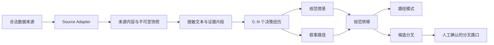

# 知乎决策路径数据库落地方案

> 版本：0.2（加入开源知识库底座选型）  
> 日期：2026-08-20  
> 当前范围：把来源回答变成可检索、可比较的决策经历、路径和分叉路口；不设计后续人生决策产品。

## 一、结论先行

这个项目不应被定义成“知乎回答库”，而应被定义成：

> 一个有原文证据、可版本化、可人工复核的决策叙事语料库。

最小分析单元不是一篇回答，而是回答中抽出的一个“决策经历（Decision Episode）”。一篇回答可以产生 0 条、1 条或多条决策经历。

推荐的第一版技术路线是：

- 用可替换的 `Source Adapter` 接收上游数据；兼容 `zly2006/zhurl` 的机器 JSON，但不与其当前字段强耦合。
- 用 PostgreSQL 作为唯一权威证据与业务状态库；从第一版引入 [`Graphiti`](https://github.com/getzep/graphiti) + Neo4j 作为可重建的时序语义图和路径查询层，详细选型见[《知识库开源底座选型调研》](./知识库开源底座选型调研.md)。
- 采用“原始采集 → 内容快照 → 证据片段 → 决策经历 → 规范情景 → 路径/分叉”的分层数据模型。
- 所有模型抽取都必须附原文证据位置、模型版本、提示词版本和置信度；未知信息保持未知。
- 分叉路口只表示“相似前置状态下存在不同选择及后续叙事”，不表示某项选择造成某个结果，更不表示推荐。
- 未取得知乎和相关权利人的授权前，不启用自动化知乎采集；MVP 先接合法导出、人工提交或已授权数据。



## 二、范围与非目标

### 2.1 当前要解决的问题

1. 发现或接收与人生决策有关的来源回答。
2. 把来源回答保存为可追踪、可更新、可删除的内容快照。
3. 从一篇回答中抽取 0..N 个决策经历。
4. 将语义相近、前置条件可比的经历合并为规范情景。
5. 在单个叙事内构造有时间证据的路径。
6. 汇总多条路径为规范转移和路径模式。
7. 在同一规范情景下识别具有不同选择的分叉路口。
8. 支持回答、经历、情景、路径和分叉的混合检索与比较。

### 2.2 明确不做

- 不提供绕过登录、签名、验证码、限流、风控或 robots 规则的技术。
- 不把知乎热度、赞同数或作者认证当作经历真实度。
- 不把自述后果解释成选择造成结果的因果证据。
- 不跨作者拼接出一条看似完整、实际不存在的“个人一生”。
- 不在本阶段输出“你应该选哪条路”的推荐。
- 不在 MVP 建立一个覆盖所有人生领域的庞大本体或知识图谱。

## 三、外部调研结论

### 3.1 `zly2006` 仓库应如何参考

最相关的仓库是 [`zly2006/zhurl`](https://github.com/zly2006/zhurl)。它是非官方知乎 CLI，可以把 JSON 输出到管道或文件，并附有从 `zhihu-plus-plus` 源码调用点整理出的非官方 API 文档。文档也明确说明这些接口不是稳定 SDK 契约。[`zhurl` API 索引](https://github.com/zly2006/zhurl/blob/main/docs/apis.md)

对本项目有用的接口形态是：

| 上游能力 | `zhurl` 文档中的形态 | 本系统只依赖的标准结果 |
|---|---|---|
| 搜索候选回答 | 搜索结果中的内容类型、ID、URL、高亮与 `paging.next` | `CandidateRef[] + next_cursor` |
| 拉取回答详情 | 回答 ID、HTML 正文、问题、作者、话题与互动计数 | `SourceRecordV1` |
| 补采同题回答 | 问题回答 feed、排序与分页 | `CandidateRef[] + next_cursor` |
| 检测编辑/删除 | 重新拉取详情 | 新快照或删除事件 |

搜索入口可以按关键词、内容类型、时间和排序分页；回答详情可以取得正文、问题、作者、话题及互动字段；问题回答列表可补充同题不同经历。具体字段见 [`搜索文档`](https://github.com/zly2006/zhurl/blob/main/docs/apis/feeds-search-history.md) 与 [`内容详情文档`](https://github.com/zly2006/zhurl/blob/main/docs/apis/content.md)。

正确的兼容方式是把 `zhurl` 放在系统边缘：

```text
zhurl 当前 JSON
      ↓
ZhurlSourceAdapter（唯一理解知乎字段的地方）
      ↓
SourceRecordV1（稳定内部契约）
      ↓
数据库与分析流水线
```

不要让核心表直接出现 `target`、`object`、`paging.next` 等知乎响应外壳字段。接口变化时只更新 Adapter。

### 3.2 当前的授权门槛

截至 2026-08-20，只读核对发现：

- 当前《知乎协议》限制未经知乎授权或许可，使用自动化程序、软件或类似工具接入知乎并收集或处理其中信息、内容。[知乎协议](https://www.zhihu.com/term/zhihu-terms)
- 当前 `robots.txt` 对通用 User-Agent 设置 `Disallow: /`，只开放特定渲染路径；特定搜索引擎另有规则。[知乎 robots.txt](https://www.zhihu.com/robots.txt)
- `zhurl` GitHub 仓库元数据的 `license` 为 `null`，仓库中也未见许可证文件；在取得作者许可前，不应复制、改编或内嵌其源码。[GitHub 仓库元数据](https://api.github.com/repos/zly2006/zhurl)
- 知乎的隐私指引同时说明了公开信息可能被第三方阅读、收集，以及用户对个人信息的删除、限制处理等权利；这不能被理解为无限制再发布授权。[知乎个人信息保护指引](https://www.zhihu.com/term/privacy?external=true)

因此本方案保留 `authorized_zhihu_adapter`，但它必须受 feature flag 和授权记录控制。没有授权时使用以下入口：

- 用户合法导出的 JSON/JSONL 文件；
- 人工提交的 URL 与正文；
- 已得到权利人授权的数据集；
- 未来正式开放的数据接口。

## 四、领域模型

完整术语见 [`CONTEXT.md`](./CONTEXT.md)。核心关系如下：

| 概念 | 精确定义 | 关键边界 |
|---|---|---|
| 来源内容 | 一篇完整回答或其他来源内容 | 是采集边界，不是分析单元 |
| 内容快照 | 某次获取时的来源版本 | 只追加，不覆盖历史版本 |
| 证据片段 | 可定位到快照正文的一段文本 | 支撑每个语义主张 |
| 决策经历 | 前置状态、决策点、行动与可能的后续观察 | 一篇回答可有 0..N 条 |
| 规范情景 | 可比较的前置状态与同类决策点 | 不包含已选行动和结果 |
| 叙事路径 | 单个自洽叙事内的有序决策经历 | 默认不跨作者 |
| 路径模式 | 多条叙事路径归纳出的规范序列 | 是聚合，不是个体预测 |
| 候选分叉 | 可能存在不同可行动选择，但证据或审核不足 | 不对外当成正式路口 |
| 分叉路口 | 同一规范情景下至少两类行动均有后续证据 | 不代表因果或优劣 |

### 4.1 五类内容必须分开

来源回答中的句子要先标记主张类型：

- `SELF_REPORTED`：作者自述经历或结果；
- `ADVICE`：建议别人采取某项行动；
- `COUNTERFACTUAL`：假设、后悔或“如果当时……”；
- `HEARSAY`：转述他人的经历；
- `GENERAL_CLAIM`：没有具体主体和时间的概括。

默认只有带明确主体和时间关系的 `SELF_REPORTED` / 经审核的 `HEARSAY` 能构成观察路径。建议与反事实可以用于发现“候选选项”，但不能伪装成已发生路径。

### 4.2 单条数据：`DecisionEpisodeV1`

下面是一个虚构示例，展示契约结构，不代表真实人物：

```json
{
  "schema_version": "decision_episode.v1",
  "episode_id": "01J...",
  "snapshot_id": "01J...",
  "analysis_run_id": "01J...",
  "episode_order": 2,
  "claim_scope": "SELF_REPORTED",
  "actor_scope": "SELF",
  "time": {
    "raw": "本科毕业时",
    "start": null,
    "end": null,
    "precision": "LIFE_STAGE"
  },
  "claims": [
    {
      "claim_id": "c1",
      "kind": "CONTEXT",
      "dimension": "education_stage",
      "concept_code": "undergraduate_graduation",
      "normalized_value": "本科毕业",
      "explicitness": "EXPLICIT",
      "confidence": 0.97,
      "evidence_span_ids": ["e1"]
    },
    {
      "claim_id": "c2",
      "kind": "DECISION_POINT",
      "concept_code": "work_or_postgraduate_study",
      "normalized_value": "工作还是继续读研",
      "explicitness": "EXPLICIT",
      "confidence": 0.94,
      "evidence_span_ids": ["e2"]
    },
    {
      "claim_id": "c3",
      "kind": "ACTION",
      "role": "CHOSEN",
      "action_archetype": "continue_postgraduate_study",
      "normalized_value": "继续读研",
      "confidence": 0.96,
      "evidence_span_ids": ["e3"]
    },
    {
      "claim_id": "c4",
      "kind": "OUTCOME",
      "dimension": "career_direction",
      "horizon": "2Y",
      "direction": "CHANGED",
      "normalized_value": "进入新的职业方向",
      "causal_language_present": false,
      "confidence": 0.86,
      "evidence_span_ids": ["e4"]
    }
  ],
  "quality": {
    "all_claims_have_evidence": true,
    "temporal_order_explicit": true,
    "review_status": "UNREVIEWED"
  }
}
```

这个契约有四条硬规则：

1. 没有证据片段的字段不能进入 `CONFIRMED` 状态。
2. 原文没有说出的年龄、城市、收入、家庭条件等保持 `UNKNOWN`，不得推断补齐。
3. `OUTCOME` 是结果观察，不自动建立 `ACTION CAUSED OUTCOME` 关系。
4. 置信度必须落在具体主张上，不能只给整条经历一个模糊总分。

## 五、上游稳定契约

所有来源适配器都输出 `SourceRecordV1`。Adapter 内部可以调用命令行工具、读取文件或接正式 API，但下游只理解这个结构。

```json
{
  "schema_version": "source_record.v1",
  "source": {
    "code": "zhihu",
    "adapter_code": "authorized_zhurl",
    "adapter_version": "adapter-1.0.0",
    "authorization_ref": "AUTH-2026-001"
  },
  "external_ref": {
    "type": "answer",
    "id": "1234567890",
    "parent": {"type": "question", "id": "987654321"}
  },
  "canonical_url": "https://www.zhihu.com/question/987654321/answer/1234567890",
  "fetched_at": "2026-08-20T08:00:00Z",
  "source_created_at": null,
  "source_updated_at": null,
  "availability": "AVAILABLE",
  "content": {
    "title": "问题标题",
    "body_format": "HTML",
    "body": "<p>回答正文……</p>",
    "language": "zh-CN"
  },
  "topics": [{"external_id": "t1", "name": "职业选择"}],
  "engagement": {
    "observed_at": "2026-08-20T08:00:00Z",
    "voteup_count": 100,
    "comment_count": 12,
    "thanks_count": null
  },
  "restricted_author": {
    "external_id": "source-user-id"
  },
  "raw": {
    "sha256": "...",
    "payload": {}
  }
}
```

注意：

- `source_created_at` / `source_updated_at` 在样本未验证前允许为空。
- `restricted_author` 只进入受限采集层，经带密钥 HMAC 生成来源内主体键后从语义层移除；默认不跨来源或跨账号画像。
- 互动数据是一条带时间的观测，不覆盖旧值。
- 幂等键是 `(source.code, external_ref.type, external_ref.id, raw.sha256)`。
- `authorization_ref` 无效或过期时，自动采集任务必须拒绝启动。

Adapter 应实现三个动作：

```text
discover(query_spec, cursor) -> CandidatePage
fetch(candidate_ref)          -> SourceRecordV1
check(external_ref)           -> AVAILABLE | UPDATED | DELETED | INACCESSIBLE
```

## 六、数据库设计

### 6.1 技术选型

第一版使用 PostgreSQL 18 + pgvector + Graphiti + Neo4j：

- PostgreSQL 负责事务、唯一约束、JSONB/GIN、文本检索、行级安全、版本与路径邻接表。
- pgvector 保存情景、经历和路径向量，先精确检索，只有基准证明需要时才启用 HNSW。
- 大型原始附件将来可以放对象存储，数据库只存 URI、哈希、权限与保留期限；MVP 的文本 JSON 可以先留在受限 schema。
- Graphiti 将已校验的 `DecisionEpisodeV1` 投影为带 episode 来源、事件时间和事实有效期的语义图；Neo4j 承担图存储、路径邻域和分叉查询。
- 图数据库不是权威数据源；任何 Graphiti/Neo4j 节点和关系都必须能从 PostgreSQL 证据账本重建。图摄入失败不能回写或覆盖原始证据。

pgvector 同时支持精确和近似近邻；HNSW 会以召回换速度，过滤还可能减少候选数，因此必须以精确结果测量 Recall@K。[pgvector 官方文档](https://github.com/pgvector/pgvector) PostgreSQL 的 GIN 可索引 JSONB、数组和 `tsvector`，[GIN 文档](https://www.postgresql.org/docs/current/gin.html)；递归 CTE 足以遍历 MVP 的邻接路径，[递归查询文档](https://www.postgresql.org/docs/current/queries-with.html)。

Graphiti 的 `episode` 与本方案的 `Decision Episode` 具有直接映射：支持紧凑 JSON 输入、来源关联、自定义 Pydantic 实体/关系类型和时间有效性。[Adding Episodes](https://help.getzep.com/graphiti/core-concepts/adding-episodes)；[Custom Entity and Edge Types](https://help.getzep.com/graphiti/core-concepts/custom-entity-and-edge-types)。首版固定 Neo4j 单库和一个语料 `group_id`；Python core API 是主写入链，MCP 只用于调试。

### 6.2 逻辑分层

```text
ingest schema     采集运行、授权、原始响应、内容身份
evidence schema   不可变内容快照、脱敏正文、证据片段
semantic schema   分析运行、决策经历、上下文/行动/结果主张
canonical schema  规范情景、行动类型、路径、转移、分叉
search schema     文本/向量检索投影，可随时重建
graph projection  Graphiti episode 映射、投影任务与 Neo4j 可重建图
```

### 6.3 核心表

#### A. 采集与来源层

| 表 | 关键字段 | 约束/用途 |
|---|---|---|
| `data_source` | `code`, `adapter_code`, `enabled` | 来源注册表 |
| `source_authorization` | `source_id`, `scope`, `valid_from`, `valid_to`, `document_ref`, `status` | 自动任务的强制门禁 |
| `ingest_job` | `source_id`, `authorization_id`, `query_spec`, `cursor`, `status`, `adapter_version` | 可恢复的发现/详情任务 |
| `raw_envelope` | `job_id`, `external_type`, `external_id`, `payload`, `payload_hash`, `fetched_at` | 受限、追加写入；同哈希幂等 |
| `content_item` | `source_id`, `external_type`, `external_id`, `parent_item_id`, `canonical_url`, `status` | 稳定内容身份；三元组唯一 |
| `engagement_observation` | `content_item_id`, `observed_at`, `voteup_count`, `comment_count`, `thanks_count` | 时间序列，不能覆盖 |
| `source_event` | `content_item_id`, `event_type`, `observed_at` | `UPDATED/DELETED/INACCESSIBLE` 等 |

#### B. 快照与证据层

| 表 | 关键字段 | 约束/用途 |
|---|---|---|
| `content_snapshot` | `content_item_id`, `captured_at`, `body_html_restricted`, `body_text_redacted`, `content_hash`, `source_updated_at` | 不可变；`content_id + hash` 唯一 |
| `evidence_span` | `snapshot_id`, `start_offset`, `end_offset`, `span_hash`, `visibility` | 坐标针对固定 `content_hash`；禁止漂移 |
| `subject_key` | `source_id`, `hmac_value`, `scope` | 不保存可逆作者映射到语义层 |

#### C. 决策语义层

| 表 | 关键字段 | 约束/用途 |
|---|---|---|
| `analysis_run` | `snapshot_id`, `pipeline_version`, `model_id`, `prompt_hash`, `schema_version`, `status` | 任一结果都能复现来源版本 |
| `decision_episode` | `analysis_run_id`, `episode_order`, `claim_scope`, `actor_scope`, `time_range`, `time_precision`, `status`, `supersedes_id` | 一个快照产生 0..N 条；修订不覆盖 |
| `semantic_claim` | `episode_id`, `kind`, `normalized_text`, `explicitness`, `confidence` | 所有抽取字段的共同父记录 |
| `claim_evidence` | `claim_id`, `evidence_span_id`, `support_type` | 多对多；确认主张至少有一条支持证据 |
| `context_claim` | `claim_id`, `role`, `dimension_code`, `concept_id`, `value_json` | `TRIGGER/CONTEXT/CONSTRAINT/RESOURCE/DECISION_POINT` |
| `episode_action` | `claim_id`, `role`, `action_archetype_id`, `specific_action` | `CONSIDERED/CHOSEN/AVOIDED/RECOMMENDED` |
| `outcome_observation` | `claim_id`, `dimension_code`, `horizon`, `direction`, `value_json`, `causal_language_present` | 观察窗口与因果措辞分开 |

`semantic_claim` 作为共同父表的价值是：每类语义数据都能共享同一套证据、置信度与审核状态，同时行动和结果仍有可索引的强类型子表。

#### D. 规范化、路径与分叉层

| 表 | 关键字段 | 约束/用途 |
|---|---|---|
| `concept` | `taxonomy_version`, `type`, `code`, `parent_id`, `label`, `status` | 版本化词表，不在业务代码里写死同义词 |
| `action_archetype` | `concept_id`, `definition`, `status` | 合并“考研/读硕”等行动表达 |
| `canonical_scenario` | `stable_id`, `status` | 情景稳定身份 |
| `scenario_version` | `scenario_id`, `version`, `definition`, `feature_spec`, `centroid`, `status` | 情景拆分/合并可追踪 |
| `scenario_membership` | `scenario_version_id`, `episode_id`, `score`, `decision`, `analysis_run_id`, `reviewer_id` | 多对多；保留拒绝和不确定结果 |
| `narrative_path` | `snapshot_id`, `actor_scope`, `status` | 单一自洽来源内的路径 |
| `narrative_path_episode` | `path_id`, `position`, `episode_id`, `temporal_relation`, `confidence` | `(path_id, position)` 唯一；不确定顺序不强连 |
| `canonical_transition` | `scenario_version_id`, `action_archetype_id`, `next_scenario_version_id`, `outcome_signature`, `version` | 规范的“从情景经行动去向哪里” |
| `transition_support` | `transition_id`, `episode_id`, `outcome_claim_id`, `membership_score` | 每条规范边都可回到证据 |
| `path_pattern` | `version`, `status`, `support_count`, `quality_metrics` | 多条叙事路径的聚合结果 |
| `path_pattern_step` | `path_pattern_id`, `position`, `transition_id` | 规范转移的有序序列 |
| `branch_point` | `scenario_version_id`, `detector_version`, `status`, `quality_metrics`, `reviewed_at` | `CANDIDATE/CONFIRMED/REJECTED` |
| `branch_option` | `branch_point_id`, `action_archetype_id`, `transition_id`, `distinct_source_count`, `outcome_coverage` | 同一路口每种行动一条或多条去向 |

#### E. 可重建检索层

| 表 | 关键字段 | 说明 |
|---|---|---|
| `embedding` | `subject_kind`, `subject_id`, `model_id`, `input_hash`, `dimensions`, `vector` | 模型升级时并存，不覆盖旧向量 |
| `search_projection` | `subject_kind`, `subject_id`, `redacted_text`, `tsvector`, `filter_columns`, `visibility` | 为混合搜索准备的物化投影 |
| `graph_projection` | `episode_id`, `graphiti_episode_uuid`, `projection_version`, `input_hash`, `status`, `projected_at` | 本地主键与 Graphiti UUID 的一对一版本映射 |
| `graph_projection_job` | `episode_id`, `operation`, `attempt`, `status`, `error_code` | `UPSERT/INVALIDATE/DELETE/REBUILD`；可重试、可审计 |
| `review_task` | `task_type`, `subject_id`, `priority`, `payload`, `status` | 情景合并、路径顺序和候选分叉的人审队列 |

### 6.4 关键数据库不变量

1. 原始响应、内容快照和分析运行只追加；修订使用 `supersedes_id` 或新版本。
2. `CONFIRMED` 的语义主张必须至少关联一条同快照证据。
3. Graphiti/Neo4j 中不存在无法映射到 `graph_projection` 和有效 `decision_episode` 的正式图事实。
4. 图投影是可删、可重建数据；投影失败不得修改 `content_snapshot`、`evidence_span` 或已审核主张。
5. 叙事路径不得默认跨 `snapshot_id/actor_scope` 拼接。
6. 正式分叉必须至少有两个不同 `action_archetype_id`。
7. 每个分叉选项的支持量按 `distinct content_item_id` 计算，不能让一篇长回答重复计票。
8. 来源删除后，正文、证据、向量、图投影和派生支持按政策撤回；保留不可逆 tombstone 仅用于防止重复采集。
9. `UNKNOWN`、`NOT_APPLICABLE` 和 `NOT_MENTIONED` 必须区分，不能都变成 SQL `NULL`。

### 6.5 索引建议

- 唯一 B-tree：`content_item(source_id, external_type, external_id)`。
- B-tree：`content_snapshot(content_item_id, captured_at DESC)`。
- B-tree：`decision_episode(snapshot_id, episode_order)`。
- B-tree：`scenario_membership(scenario_version_id, decision, episode_id)`。
- B-tree：`canonical_transition(scenario_version_id, action_archetype_id)`。
- B-tree：`narrative_path_episode(path_id, position)`。
- 唯一 B-tree：`graph_projection(episode_id, projection_version)`；另对 `graphiti_episode_uuid` 建唯一索引。
- B-tree：`graph_projection_job(status, operation, created_at)`，供工作队列与失败重试。
- GIN：高频 JSONB 筛选字段、规范概念数组和 `search_projection.tsvector`。
- 向量：小数据使用精确检索；达到实际延迟阈值后，对指定 `model_id` 建部分 HNSW cosine 索引。
- 受限表启用 Row-Level Security；原始正文角色与分析角色分离，分析服务默认只读脱敏文本。

中文全文检索的分词效果必须用真实语料评估。MVP 不把单一分词器当唯一入口，而采用关键词/短语匹配、结构化过滤和向量召回的混合结果。

## 七、处理流水线

### 7.1 从来源到经历

1. **来源门禁**：验证 `authorization_ref`、允许用途、有效期、限速与保留期。
2. **候选发现**：按“领域词 × 决策表达词 × 时间窗口”生成查询；保存查询、游标和召回来源。
3. **详情获取**：候选 ID 去重后获取详情；正文哈希未变化则只新增互动观测。
4. **规范化**：HTML 清洗、正文标准化、语言检测、恶意内容隔离；原始快照不可变。
5. **隐私处理**：识别并遮蔽电话、地址、身份证号、账号、医疗/金融等敏感信息；仅脱敏文本进入模型。
6. **资格分类**：判断内容是亲历、建议、反事实还是泛泛观点；不包含决策经历的回答保留来源但产出 0 条经历。
7. **边界切分**：按主体、时间和决策点切成 0..N 个经历候选。
8. **结构化抽取**：输出 JSON Schema；每个主张必须提供证据偏移，未明确的信息输出未知。
9. **验证**：校验偏移、证据是否真支持主张、时间顺序、枚举和 schema；失败进入重试或人审。
10. **概念归一**：把具体措辞链接到版本化概念与行动类型，同时保留原文表达。

### 7.2 从经历到规范情景

情景聚类只使用“前置状态 + 决策点”，明确排除已选行动和结果，避免结果泄漏使“走了同一条路的人”被错误聚在一起。

处理分四级：

1. **硬过滤（blocking）**：决策领域、决策点大类、宽粒度人生阶段存在明显冲突时不比较。
2. **候选召回**：将前置状态与决策点生成 `scenario_signature` 和向量，检索现有情景 Top-K。
3. **精确比较**：规则/模型逐维判断 `SAME / DIFFERENT / UNCERTAIN`，输出冲突维度和证据。
4. **决策与版本**：高置信自动加入；边界样本进入人审；无法加入者形成新情景候选。合并或拆分时创建新 `scenario_version`。

不建议每天全量重新聚类。增量策略是：新经历优先匹配已有情景，只定期对“未归类候选池”和低内聚情景做批处理重聚类。

### 7.3 构造叙事路径

路径只能使用明确的时间或因果叙事信号：

- 同一回答中出现“毕业后 → 工作两年 → 辞职读研”，可以形成有序经历。
- 只有段落顺序、没有时间证据时，边标记为 `UNCERTAIN`，不进入正式路径。
- “我朋友后来……”切换主体时，新建路径或中断路径。
- “如果当年读研……”是反事实分支，不是已观察路径。

一条经历先转成局部结构：

```text
规范情景 --选择行动类型--> 后续状态/结果观察
```

同一叙事中有明确后续决策时，再把后续状态链接到下一规范情景。多条叙事路径中重复出现的规范转移可以组成路径模式。

## 八、检索、比较和分叉识别

### 8.1 检索回答与经历

检索分两层返回：

1. **来源检索**：找到相关回答和证据位置。
2. **经历检索**：找到“处境相近、面对相同决策点”的决策经历。

推荐混合召回：

```text
结构化硬过滤
    ├─ 关键词/短语/概念召回
    └─ 向量 Top-K 召回
             ↓
        RRF 合并与重排
             ↓
  返回经历 + 情景 + 原文证据 + 质量状态
```

不能只做向量搜索，因为用户经常需要严格过滤人生阶段、决策领域、时间窗口和证据状态；也不能只做关键词，因为同一行动有大量不同说法。

### 8.2 高效比较“路与路”

禁止对所有路径做两两比较。采用以下策略把 (O(N^2)) 降到近似 (O(N \times K))，其中 K 是小规模候选数：

1. 为每条路径生成规范序列：`scenario → action → scenario/outcome`。
2. 保存路径的起点情景、领域、长度桶、规范前缀哈希和向量。
3. 先按起点/共有情景和结构字段过滤，再取向量 Top-K（建议从 20–50 起做基准）。
4. 只对候选路径执行带权序列对齐：情景匹配权重大于行动措辞，明确时间边大于推测时间边。
5. 对已进入规范转移图的路径，不再做路径对路径比较；直接在共同 `scenario_version_id` 上连接和聚合。

“第一处分叉”可以通过序列对齐找到：两条路径共享同一规范情景，下一条规范行动不同。若只是相同行动得到不同结果，应标记为“结果分化”，不是“决策分叉”。

### 8.3 分叉路口识别

对每个当前版本的规范情景：

1. 收集已接受的经历成员。
2. 按 `CHOSEN` 行动归一到 `action_archetype`。
3. 对每种行动计算不同来源数、后续路径覆盖率、结果观察覆盖率和证据质量。
4. 至少两种行动达到支持门槛时生成 `Branch Candidate`。
5. 检查情景内聚度、关键前置条件冲突、重复来源、同一作者重复计数和结果时间窗可比性。
6. 高价值候选进入人审，审核后才成为 `CONFIRMED Branch Point`。

试点门槛建议设为可配置值：

- 每个行动至少 3 个不同来源内容支持；演示数据不足时可暂降到 2，但只能显示为候选。
- 每个行动至少有一部分样本包含后续状态或结果观察。
- 所有正式支持边都能回溯到证据片段。
- 情景存在重大约束冲突时拆分情景，不用低质量平均值掩盖差异。

分叉质量分只用于排序审核队列，可由以下因素组成：情景内聚度、最小行动支持数、行动多样性、后续覆盖率、证据完整度和来源去重率。它不能被展示成某条路的“成功概率”。

### 8.4 增量更新

| 变化 | 处理 |
|---|---|
| 回答未变、互动数变化 | 只新增 `engagement_observation` |
| 回答正文编辑 | 新增快照，旧经历保留并标记被新分析替代 |
| 来源删除/不可访问 | 记录事件，执行撤回策略，减少路径/分叉支持数 |
| 模型或提示词升级 | 新建 `analysis_run`，与旧版本并行评测，不覆盖 |
| 概念/情景拆分合并 | 新建版本，迁移成员，旧版本仍可审计 |
| 新经历到达 | 只比较现有情景 Top-K，更新受影响的转移和分叉 |

## 九、服务边界与接口草案

### 9.1 写入接口

```text
POST /v1/source-records:batch
POST /v1/ingest-jobs                 # 仅授权来源
POST /v1/analysis-runs
POST /v1/reviews/{task_id}/decision
```

### 9.2 查询接口

```text
GET /v1/search/sources?q=&filters=
GET /v1/search/episodes?q=&scenario=&filters=
GET /v1/scenarios/{scenario_id}
GET /v1/paths/{path_id}
GET /v1/scenarios/{scenario_id}/transitions
GET /v1/branches/{branch_id}
GET /v1/branches/{branch_id}/evidence
POST /v1/paths:compare
```

所有查询对象都要返回：

- `data_version`、`taxonomy_version` 和 `analysis_version`；
- `review_status` 与置信度；
- 可见范围内的证据定位；
- 来源可用性和更新时间；
- “自述不等于验证事实、相关不等于因果”的数据说明。

## 十、质量评估

先建立 200–500 篇人工标注的黄金集，覆盖：无经历回答、单经历、多经历、建议、反事实、转述、模糊时间、主体切换、编辑和删除。

### 10.1 离线指标

| 环节 | 指标 |
|---|---|
| 经历检测 | Precision / Recall / F1，重点防止建议被当经历 |
| 经历边界 | 与人工边界的匹配率 |
| 字段抽取 | 各字段准确率、未知值误补率 |
| 证据 | 证据支持率、偏移有效率；正式主张目标 100% 可定位 |
| 情景合并 | 同情景 pair precision/recall、人工一致率 |
| 路径顺序 | 明确时间边 precision；宁缺毋滥 |
| 分叉识别 | 人审 precision；正式分叉优先高精度 |
| 检索 | Recall@20、nDCG@10、过滤正确率 |
| HNSW | 相对精确向量搜索的 Recall@K 与 p95 延迟 |

### 10.2 MVP 验收线

- 相同 `SourceRecordV1` 重放不会产生重复内容或重复快照。
- 任何正式经历主张都能定位到同一内容哈希下的证据片段。
- 一篇多阶段回答能稳定拆成多条经历，并保留顺序不确定性。
- 建议、反事实和相同行动下的结果分化不会被误报为正式分叉。
- 删除事件能够使相关正文、向量和聚合支持按策略失效。
- 每条已投影经历都保存 `decision_episode_id ↔ graphiti_episode_uuid`，且能由图结果反查原文证据。
- 回答编辑能保留旧快照，并通过普通 `add_episode` 使旧图关系按策略失效；持续更新不使用缺少 invalidation 的 bulk API。
- 删除一个来源时，仍被其他来源支持的图事实必须保留；全图可从 PostgreSQL 重建。
- 关键查询在试点规模下达到约定 p95；若向量检索超标，才进入 HNSW 调优。
- 人工抽查的正式分叉 precision 建议达到 90% 后再扩大语料；低于门槛时只展示候选。

## 十一、实施路线

### 11.1 48 小时内部技术验证（不是对外第一版）

目标不是现场打通未经授权爬虫，而是证明“来源内容 → 经历 → 情景 → 路径 → 分叉”的闭环。

1. 准备 100–300 篇有合法使用依据的回答文本或虚构/授权样本，转成 `SourceRecordV1 JSONL`。
2. 建 PostgreSQL 核心表：内容、快照、证据、经历、情景、行动、转移、分叉。
3. 实现 JSON Schema 抽取与证据偏移校验。
4. 人工先定义 10–20 个规范情景和 20–40 个行动类型，避免演示期失控聚类。
5. 固定 Graphiti 自定义实体/关系，用 Neo4j 投影已校验经历并保存 UUID 映射。
6. 生成经历向量，做混合检索和 Top-K 情景匹配。
7. 构造 3–5 个有真实证据链的候选分叉，展示来源追溯和路径比较。

演示成功标准：任意点开一条分叉，都能回到具体经历和原文证据；刷新同一批数据不会重复写入。

### 11.2 4–6 周试点

| 周期 | 交付 |
|---|---|
| 第 1 周 | 来源契约、授权门禁、导入器、快照/删除/幂等 |
| 第 2 周 | 脱敏、经历抽取、证据校验、黄金集首版 |
| 第 3 周 | Graphiti/Neo4j 投影器、自定义类型、ID 映射、重试与重建 |
| 第 4 周 | 概念归一、规范情景、叙事路径、候选分叉和比较 API |
| 第 5 周 | 混合搜索、人审队列、性能基准、精确与 HNSW 对照 |
| 第 6 周 | 编辑/删除/并发/恢复演练、质量审计、许可证与扩量决策 |

只有在授权完成后，才把 `authorized_zhihu_adapter` 接到同一 `SourceRecordV1` 入口；它不应改变下游任何表或算法。

## 十二、主要风险与对策

| 风险 | 后果 | 对策 |
|---|---|---|
| 未授权自动采集 | 账号、合规和项目持续性风险 | feature flag + 授权表 + 无授权拒绝运行 |
| API/响应变化 | 采集链路频繁失效 | Adapter 隔离、原始响应归档、契约测试 |
| 自述不真实或幸存者偏差 | 路径被误当普遍规律 | 明示叙事性质、来源多样性、不给成功概率 |
| LLM 补齐未知信息 | 产生虚构画像和虚假分叉 | 证据强约束、字段级置信度、未知值测试 |
| 按行动/结果聚类 | 把不同处境误合并 | 情景向量只包含前置状态和决策点 |
| 全路径两两比较 | 成本随数据平方增长 | blocking + Top-K + 规范转移聚合 |
| 情景随模型升级漂移 | ID 不稳定、结果无法复现 | 稳定 ID + `scenario_version` + 并行分析运行 |
| 敏感个人信息扩散 | 隐私与安全风险 | 最小化、HMAC 主体键、脱敏文本、RLS、删除同步 |
| 把图数据库当权威源 | LLM 抽取缺陷或库升级导致证据不可恢复 | PostgreSQL 权威存储；Graphiti/Neo4j 只作带版本的可重建投影 |
| Graphiti/FalkorDB 多 group 并发问题 | 跨图静默写错或读写路由异常 | 第一版使用 Neo4j 单库、固定 group、core API 和并发回归测试 |
| Graphiti schema/属性抽取失败 | 产生通用实体、错误关系或缺失业务属性 | 固定类型与允许矩阵；业务属性只认 PostgreSQL；入图后校验 |

## 十三、现在应冻结的五个决定

1. `Decision Episode` 是最小数据单元，不是整篇回答。
2. 原始快照不可变，语义结果可版本化，所有结论可回到证据。
3. 规范情景不含行动和结果，防止聚类结果泄漏。
4. PostgreSQL + pgvector 是权威层；第一版即使用 Graphiti + Neo4j，但图始终只是可重建投影。
5. 知乎自动采集必须有授权门禁；`zhurl` 只通过 Adapter 兼容。

如果这五点不变，后续可以分别迭代采集器、抽取模型、聚类算法和图分析，而不会推翻数据库骨架。

## 参考资料

- [知识库开源底座选型调研](./知识库开源底座选型调研.md)
- [Graphiti](https://github.com/getzep/graphiti)
- [Graphiti Adding Episodes](https://help.getzep.com/graphiti/core-concepts/adding-episodes)
- [Graphiti Custom Entity and Edge Types](https://help.getzep.com/graphiti/core-concepts/custom-entity-and-edge-types)
- [`zly2006/zhurl`](https://github.com/zly2006/zhurl)
- [`zhurl` API 索引](https://github.com/zly2006/zhurl/blob/main/docs/apis.md)
- [`zhurl` 搜索/信息流文档](https://github.com/zly2006/zhurl/blob/main/docs/apis/feeds-search-history.md)
- [`zhurl` 内容详情文档](https://github.com/zly2006/zhurl/blob/main/docs/apis/content.md)
- [知乎协议](https://www.zhihu.com/term/zhihu-terms)
- [知乎 robots.txt](https://www.zhihu.com/robots.txt)
- [知乎个人信息保护指引](https://www.zhihu.com/term/privacy?external=true)
- [中华人民共和国个人信息保护法](https://www.ssf.gov.cn/portal/rootimages/uploadimg/1641708111970375/1641708111970375.pdf)
- [PostgreSQL 18 全文检索](https://www.postgresql.org/docs/current/textsearch.html)
- [PostgreSQL 18 GIN 索引](https://www.postgresql.org/docs/current/gin.html)
- [PostgreSQL 18 递归查询](https://www.postgresql.org/docs/current/queries-with.html)
- [pgvector](https://github.com/pgvector/pgvector)
