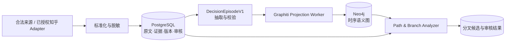
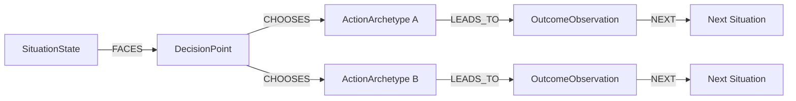

# 知乎决策情景知识库：开源底座选型调研

> 结论版：1.0  
> 调研日期：2026-08-20  
> 目标：为“知乎回答 → 决策经历 → 情景 → 路径 → 分叉路口”选择一个最合适的开源知识库底座。  
> 范围：只负责构建、检索和比较路径，不讨论分叉路口后续如何给用户做决策。

## 一、唯一推荐

**选择 [`getzep/graphiti`](https://github.com/getzep/graphiti) 作为时序知识图谱底座。**

第一版不是只部署 Graphiti，而是采用下面这个完整但克制的组合：

> **PostgreSQL 权威证据库 + Graphiti 语义图引擎 + Neo4j 图存储 + 自有分叉分析器。**

其中 Graphiti 是本次要选的开源知识库核心。PostgreSQL 负责不可丢失、不可由模型篡改的原文、证据、版本、审核和任务状态；Graphiti/Neo4j 是可从 PostgreSQL 重建的时序语义图。

为什么是它：本项目的基本单位是“某人在某个时间、某种处境下作出选择，并叙述了后续”，而 Graphiti 的基本单位恰好是带来源和时间的 `episode`。它原生支持来源追踪、事实有效期、自定义实体/关系类型和混合图检索，比以“文档切块 + 问答”为中心的普通 RAG 更接近我们的业务对象。[Graphiti 的 episode 文档](https://help.getzep.com/graphiti/core-concepts/adding-episodes)明确说明 episode 是一次摄入事件，可用于时间点查询和 provenance；[自定义类型文档](https://help.getzep.com/graphiti/core-concepts/custom-entity-and-edge-types)支持 Pydantic 类型、关系约束和按类型检索。

这里的 KISS 不是“强行只用一个数据库”，而是：

- 原文事实只认 PostgreSQL；
- 关系分析只走 Graphiti/Neo4j；
- 两者只通过一个版本化的 `DecisionEpisodeV1` 契约连接；
- 图坏了可以重建，不让模型生成物反过来污染原始证据。

## 二、我们要选的不是普通问答知识库

这个系统需要回答四类问题：

1. 某条路径来自哪篇回答、哪个版本、哪段原文？
2. 一篇回答里包含几个相互独立的决策经历，它们按什么顺序发生？
3. 哪些经历面对的是同一种前置情景，而不是仅仅主题相似？
4. 在同一情景和决策点下，是否出现了不同选择及不同后续路径？

因此核心对象不是 `Document/Chunk`，而是：

- `SourceSnapshot`：一篇来源内容在某个时间的不可变快照；
- `EvidenceSpan`：支持一条主张的原文片段；
- `DecisionEpisode`：一个有证据的决策经历；
- `CanonicalScenario`：多个经历共享的规范前置情景；
- `NarrativePath`：同一叙事中的有序经历；
- `BranchCandidate/BranchPoint`：相似前置状态下出现不同选择的候选/审核后分叉。

如果底座只能回答“这篇文章讲了什么”，却不能维护事件、时间、证据和关系有效期，它再热门也不适合。

## 三、调研范围与评分方法

本轮覆盖了时序知识图谱、GraphRAG、中文领域知识图谱、企业知识平台和通用 RAG 产品，共 13 类项目：

| 项目 | 类型 | 本轮结论 |
|---|---|---|
| Graphiti | 双时序知识图谱内核 | **唯一推荐** |
| Cognee | 完整知识/Agent memory 平台 | 平台型第二名 |
| OpenSPG/KAG | 中文垂域知识工程与推理 | 条件备选 |
| FalkorDB GraphRAG-SDK | schema + provenance GraphRAG | 文档图谱备选，当前缺时序 |
| Microsoft GraphRAG | 社区图谱与全局/局部 RAG | 后期主题分析组件 |
| LightRAG | 轻量增量 GraphRAG | 后期检索组件 |
| RAGFlow | 完整文档 RAG 产品 | 可做应用层，不做主图 |
| FastGraphRAG | 轻量 PageRank GraphRAG | 原型/算法组件 |
| Neo4j LLM Graph Builder | 文档转图与聊天应用 | 参考应用 |
| Dify | 知识管道与 Agent 工作流 | 应用编排层 |
| LlamaIndex PropertyGraph | 图抽取与存储开发库 | 连接层 |
| HippoRAG | 多跳检索算法 | 研究/检索组件 |
| nano-graphrag | 简化 GraphRAG | 实验组件 |

评分权重如下：

| 维度 | 权重 | 本项目为什么在意 |
|---|---:|---|
| 领域适配 | 25% | 能否直接表达情景、选择、结果、时间和路径 |
| 证据与溯源 | 15% | 派生节点/关系能否回到原文和版本 |
| 增量与时序 | 15% | 编辑、删除、后续补充和事实失效能否被正确处理 |
| 数据扩展 | 10% | 能否固定领域 schema，并接入现有数据层 |
| 检索与图分析 | 10% | 是否支持混合检索、多跳和路径邻域 |
| 工程成熟度 | 10% | 文档、测试、部署、API 和维护状态 |
| 许可证 | 10% | 开源许可是否清晰，依赖风险是否可控 |
| 中文/模型中立 | 5% | 能否替换 LLM、embedding，并处理中文 |

下面是 1–5 分的领域适配评分。总分是加权结果，用于本项目内部选型，不是通用产品排行榜：

| 候选 | 领域 | 溯源 | 时序 | 扩展 | 检索 | 工程 | 许可 | 中文 | 加权总分 |
|---|---:|---:|---:|---:|---:|---:|---:|---:|---:|
| **Graphiti** | 5.0 | 4.5 | 5.0 | 4.5 | 4.5 | 4.0 | 5.0 | 4.0 | **93.5** |
| Cognee | 4.0 | 4.0 | 4.5 | 5.0 | 4.5 | 4.0 | 5.0 | 4.5 | **87.0** |
| OpenSPG/KAG | 4.5 | 4.5 | 2.5 | 5.0 | 5.0 | 3.0 | 5.0 | 5.0 | **84.5** |
| Microsoft GraphRAG | 3.0 | 4.5 | 3.0 | 4.0 | 5.0 | 4.5 | 5.0 | 4.0 | **78.5** |
| LightRAG | 3.0 | 3.5 | 3.5 | 4.0 | 4.5 | 4.5 | 5.0 | 4.5 | **76.5** |
| FalkorDB GraphRAG-SDK | 3.5 | 4.5 | 2.0 | 4.5 | 4.5 | 4.0 | 4.0 | 4.0 | **75.0** |
| RAGFlow | 2.5 | 4.5 | 2.0 | 4.0 | 4.5 | 4.0 | 5.0 | 5.0 | **72.0** |

2026-08-20 的 GitHub 快照也做了核对：Graphiti、Cognee、LightRAG、Microsoft GraphRAG 和 RAGFlow 都在近期更新；KAG 的正式 release 与 push 节奏相对较慢。Stars 只用于判断生态，没有进入上述适配分。

## 四、Graphiti 为什么最匹配

### 4.1 `episode` 与我们的“单条数据”是同一种形状

Graphiti 把每次摄入视为一个 episode 节点，支持文本、消息和 JSON，并通过 `MENTIONS` 将 episode 与从中提取的实体连接。这使我们可以把一个 `DecisionEpisodeV1` 作为一条紧凑 JSON 输入，而不是把整篇知乎回答粗暴当作一个知识单元。

映射关系非常直接：

| 我们的对象 | Graphiti 对象 |
|---|---|
| `DecisionEpisode` | `EpisodicNode` / JSON episode |
| 经历发生时间 | `reference_time` / `valid_at` |
| 摄入时间 | `created_at` |
| 来源说明 | `source_description` |
| 情景、决策点、行动、结果 | 自定义 Entity Types |
| 面对、选择、导致后续 | 自定义 Edge Types |
| 同一回答里的先后经历 | `previous_episode_uuids` / saga 顺序 |
| 来源追踪 | episode `MENTIONS` 与事实支持集 |

### 4.2 双时序比“增量重建”更适合人生经历

普通 GraphRAG 的“增量”通常表示某篇文档变了以后重新抽取，并清掉孤儿节点。Graphiti 进一步区分信息何时录入、叙述事件何时发生，并在新事实出现时让旧事实失效而不是直接覆盖。这对于以下情况很重要：

- 作者编辑了原回答；
- 作者几年后补充了结果；
- 同一个人的状态随时间变化；
- 模型重跑后需要对比旧图和新图；
- 来源被删除，但其他来源仍支持同一事实。

### 4.3 可以冻结我们的领域 schema

Graphiti 允许用 Pydantic 定义实体和关系属性，并用 `edge_type_map` 限定关系。首版固定四类实体和四类核心关系即可：

```text
SituationState     前置状态，只放决策发生前已知的条件
DecisionPoint      当时真正要决定的问题
ActionArchetype    采取的规范行动类型
OutcomeObservation 后续观察，只表示来源中的叙述

FACES              SituationState -> DecisionPoint
CHOOSES            DecisionPoint -> ActionArchetype
LEADS_TO           ActionArchetype -> OutcomeObservation
NEXT               OutcomeObservation -> SituationState
```

这已经足以表达路径；不要第一版就创建几十种实体和关系。

### 4.4 检索和图遍历都能复用

Graphiti 提供语义、关键词和图关系的混合检索，可按 group、节点类型、关系类型和时间过滤。Neo4j 则直接承担路径邻域和分叉查询。我们不需要再造一套图检索框架。

### 4.5 许可与生态可接受

Graphiti 本身是 Apache-2.0、Python 3.10+，支持 Neo4j、FalkorDB 和 Neptune，项目维护活跃。[Graphiti 仓库](https://github.com/getzep/graphiti)同时提醒：结构化输出能力较弱的小模型可能导致 schema 错误和摄入失败，因此中文模型必须用黄金集实测，不能只看模型宣称支持中文。

## 五、为什么不是另外几个热门项目

### Cognee：功能更全，但核心能力仍绕回 Graphiti

[`topoteretes/cognee`](https://github.com/topoteretes/cognee) 有 `add → cognify → search/memify`、自定义 DataPoint/管道、多存储、权限、可观察性和 UI。如果目标是通用企业知识平台，它比 Graphiti 更开箱即用。

但对本项目来说：

- temporal mode 本身集成了 Graphiti，关键优势并不是 Cognee 独有；
- 多一层 DataPoint、pipeline、storage abstraction 会扩大调试面；
- provenance stamping 仍在完善，不能替代我们要求的字符级证据账本；
- 现成权限/UI 不能弥补决策情景、路径和分叉仍需自建这一事实。

所以 Cognee 是第二名，不是核心首选。以后若项目变成多团队、多来源的通用知识平台，再评估把 Graphiti 包进 Cognee。

### OpenSPG/KAG：中文本体和推理强，但时序不够直接

[`OpenSPG/KAG`](https://github.com/OpenSPG/KAG) 的 schema-constrained extraction、概念对齐、chunk 与知识双向索引、逻辑形式多跳推理都很强，尤其适合中文垂直领域。

问题是它需要 OpenSPG Server 和更重的知识工程栈，文档重点是本体构建与复杂问答，没有发现等价于 Graphiti 的双时序 episode、事实有效期与失效传播。若未来重点变成“复杂逻辑问答”，它值得重新评估；当前路径积累阶段过重。

### FalkorDB GraphRAG-SDK：传统文档图谱里很强，但时序还在路线图

[`FalkorDB/GraphRAG-SDK`](https://github.com/FalkorDB/GraphRAG-SDK) v1.4.0 具备 schema、完整 Document→Chunk→Entity 来源链、crash-safe 单文档更新、删除和共享实体保留，工程设计值得借鉴。

它自己的路线图把 temporal graph 放在 2026-Q4，说明当前版本还不能满足本项目的一开始就有的时序要求；`finalize()` 的跨文档实体消歧还是 O(graph size)。因此它是“文档 GraphRAG 备选”，不是当前主库。

### Microsoft GraphRAG：擅长全局主题，不擅长维护业务事件

[`microsoft/graphrag`](https://github.com/microsoft/graphrag) 会生成 TextUnit、实体、关系、claim、社区和社区摘要，并已支持 `update`。TextUnit 给实体/关系提供了不错的来源 breadcrumb。[官方输出模型](https://microsoft.github.io/graphrag/index/outputs/)和[查询概览](https://microsoft.github.io/graphrag/)表明它的中心任务仍是语料的 Global/Local/DRIFT RAG，不是 episode 双时序账本。

它适合后期回答“所有回答里有哪些宏观主题”，不应成为情景与路径的权威库。

### LightRAG：检索效率强，但来源支持集和时序不足

[`HKUDS/LightRAG`](https://github.com/HKUDS/LightRAG) 支持增量写入、删除、图+向量检索、多后端和中文配置，是很好的轻量检索框架。但默认图是通用实体关系，缺乏 episode、双时序和严格领域 schema；实现还允许限制每条关系保存的来源数量，不适合把它直接当作完整证据账本。

### RAGFlow：产品完整度高，但 GraphRAG 不是它的权威数据层

[`infiniflow/ragflow`](https://github.com/infiniflow/ragflow) 的文档解析、chunk 编辑、引用、检索 UI 与 Agent 很成熟。它更适合快速做文档问答产品；当前 GraphRAG 增量、全局重算和 checkpoint 等问题仍在演进。我们的分叉语义仍需另建，承担整套重型产品没有换来核心模型的减少。

### 其他项目

- FastGraphRAG：轻量、增量、PageRank 检索好，但更像检索库。
- Neo4j LLM Graph Builder：自定义 schema、可视化和聊天很好，但属于文档转图参考应用。
- Dify：知识管道与工作流很强，queue-based graph engine 是执行图，不是知识关系图。
- LlamaIndex PropertyGraph：适合写抽取/存储连接代码，不是带时序、审计和审核的完整系统。
- HippoRAG、nano-graphrag：适合算法实验，生产领域治理不足。

## 六、KISS 架构：两层数据、一个契约、一个分叉器



各组件只做一件事：

| 组件 | 唯一职责 | 明确不做 |
|---|---|---|
| Source Adapter | 把合法来源统一成 `SourceRecordV1` | 不理解决策语义 |
| PostgreSQL | 保存原文事实、证据、版本、审核和任务状态 | 不依赖 LLM 关系作为事实 |
| Episode Extractor | 从一个快照抽出 0..N 条有证据经历 | 不跨人拼接人生 |
| Graphiti Worker | 把已校验 episode 投影成时序图 | 不成为原文权威库 |
| Branch Analyzer | 在规范情景下找不同选择及后续 | 不给人生建议，不声称因果 |

### 6.1 PostgreSQL 是权威账本

第一版至少保留这些逻辑表；完整字段见主方案：

| 表 | 保存什么 |
|---|---|
| `content_snapshot` | 不可变正文版本、hash、来源状态 |
| `evidence_span` | 字符偏移、短证据、脱敏版本 |
| `decision_episode` | 结构化经历、时间精度、置信度、模型版本 |
| `canonical_scenario` | 人工/模型共同维护的规范情景与版本 |
| `graph_projection` | 本地主键、Graphiti UUID、投影版本与状态 |
| `branch_candidate` | 分叉算法输出、支持数、冲突和质量分 |
| `review_decision` | 人审接受/拒绝及理由 |

所有正式主张都必须通过 `evidence_span_id` 回到同一个 `content_hash`。Graphiti 里的属性只是索引副本，不是权威值。

### 6.2 Graphiti/Neo4j 是可重建语义图



Graphiti 自己维护 episode 对实体/事实的来源关联。我们的 `graph_projection` 表再保存外部 ID 映射，使删除、重跑和审计能从 PostgreSQL 精确驱动。

首版固定一个 `group_id`（例如 `zhihu_decision_v1`）和一个 Neo4j 数据库。不要把每篇回答、每个主题或每个用户做成独立 group；`group_id` 只用于语料/租户隔离。

### 6.3 一篇回答如何变成路径

1. Adapter 写入不可变 `content_snapshot`。
2. 脱敏后按段落保留字符偏移，生成 `evidence_span`。
3. Extractor 抽出 0..N 个 `DecisionEpisodeV1`；每条只描述一个“前置情景—决策点—实际行动—后续观察”。
4. 每条 episode 通过 JSON Schema、证据偏移和枚举校验；失败进入人工队列。
5. Graphiti Worker 把紧凑 JSON 作为 `EpisodeType.json` 写入，显式传入四类 entity、四类 edge 和 `edge_type_map`。
6. 同一回答存在明确先后顺序时，用上一条 Graphiti episode UUID 连接；时间不明确时不编造顺序。
7. Worker 校验预期类型和最小关系数，保存 `decision_episode_id ↔ graphiti_episode_uuid`。
8. 情景归一服务把 episode 分配到 `canonical_scenario`；Graphiti community 只用于探索，不直接等同规范情景。
9. Branch Analyzer 在同一规范情景/决策点下聚合不同 `ActionArchetype` 及后续路径，生成候选。
10. 只有满足独立来源、证据、可比性和人审门槛的候选才升级为 `BranchPoint`。

### 6.4 分叉判断保持简单

一个正式分叉至少满足：

```text
同一 CanonicalScenario
+ 同一 DecisionPoint
+ 至少两个不同 ActionArchetype
+ 每条行动分支都有独立 DecisionEpisode 和证据
+ 后续顺序可解释
+ 通过人工审核
= BranchPoint
```

结果不同但行动相同，叫“结果分化”，不是分叉；不同人的经历只能聚合为路径模式，不能拼成一条虚构人生。

## 七、Graphiti 的已知风险与强制护栏

推荐不等于盲信。2026-08 的公开仓库仍有以下生产风险：

| 风险 | 第一版处理 |
|---|---|
| FalkorDB 多 `group_id` 并发写入存在共享 driver 竞态报告 | 首版使用 Neo4j 单库；固定 group；做并发隔离测试 |
| 长 episode 会触发大量 LLM 调用 | 先外部拆成紧凑决策经历；限制大小与并发 |
| 未传类型时实体退化为通用 `Entity` | schema、类型和 `edge_type_map` 全部固定 |
| 未匹配关系仍可能退化为 `RELATES_TO` | 入图后做允许列表校验，异常进入审核 |
| 首次自定义 edge attribute 有公开抽取问题 | 证据、审核和业务属性只认 PostgreSQL |
| 预分配 episode UUID/创建响应映射仍在演进 | 使用 Python core API；显式保存本地 ID 与返回 UUID 映射 |
| `add_episode_bulk` 不做 edge invalidation | 仅空图初装可 bulk；持续更新用普通 `add_episode` |
| MCP 的部分路由/排序行为仍在演进 | MCP 只调试；主写入、查询和删除封装 core API |
| 缺少完整 PII 治理与检索审计 | 入图前脱敏；检索后权限过滤；PostgreSQL 记审计 |
| 小模型 structured output 可能失败 | 固定模型/提示版本，黄金集评测，严格 schema 校验 |

相关公开证据包括：[FalkorDB 并发 group 问题](https://github.com/getzep/graphiti/issues/1676)、[长 episode 吞吐问题](https://github.com/getzep/graphiti/issues/1516)、[自定义关系属性问题](https://github.com/getzep/graphiti/issues/1111)、[外部 episode UUID 问题](https://github.com/getzep/graphiti/issues/1646)及[治理 hooks 请求](https://github.com/getzep/graphiti/issues/1679)。这些问题也是为什么 Graphiti 必须是“可重建投影”，不能成为唯一数据库。

Graphiti 的 Apache-2.0 不等于整套部署只有这一种许可证。首版建议的 [Neo4j Community Edition 是 GPLv3](https://github.com/neo4j/neo4j)；把 Neo4j 作为独立服务部署，并在实际分发或托管前按产品形态完成许可证复核。

## 八、“完善的第一版”必须包含什么

第一版不是只有一个聊天框，也不是只把 100 篇回答向量化。以下八项要同时交付：

1. **合法数据入口**：授权 Adapter、合法导出、人工提交三种方式走同一契约；无授权时自动知乎采集不可启动。
2. **幂等与版本**：重复输入不重复建图；回答编辑生成新快照；删除事件能驱动证据、图投影和聚合失效。
3. **证据化抽取**：一篇回答拆 0..N 个 episode；正式字段都有原文偏移、模型/提示版本和置信度。
4. **固定领域图**：四类实体、四类关系、允许矩阵和投影校验全部落地。
5. **路径构建**：保留单一叙事内部的明确时间顺序，不把不同作者拼接成一条人生。
6. **分叉分析**：blocking + Top-K 找相似前置情景，再做精确比较；正式分叉必须人审。
7. **检索与溯源**：按情景、时间、行动、后续过滤；任何图结果都能回到快照和证据片段。
8. **运维与评测**：任务重试、死信、模型成本、结构失败率、删除演练、黄金集和图重建脚本。

建议验收线：

- 100% 的正式 episode/分叉可以回到 `content_hash + evidence_span`；
- 同一输入重放后 PostgreSQL 与 Neo4j 均不重复；
- 编辑测试能保留历史并使旧关系按策略失效；
- 删除一个来源时，共同被其他来源支持的图事实仍保留；
- 未知时间不会被伪造成精确时间；
- Graphiti 投影失败不会影响权威证据，且任务可安全重试；
- 试点集的正式分叉人审 precision 达到 90% 前只展示候选；
- 试点规模下情景检索和分叉展开达到约定的 p95 延迟。

## 九、六周落地计划

| 周期 | 交付物 | 验收重点 |
|---|---|---|
| 第 1 周 | PostgreSQL 权威表、授权门禁、Adapter 契约、Neo4j/Graphiti 固定版本 | 幂等、快照、删除事件、容器可重复部署 |
| 第 2 周 | `DecisionEpisodeV1` 抽取、脱敏、证据偏移、黄金集 | 不补未知、证据定位正确 |
| 第 3 周 | Graphiti Projection Worker、自定义类型/关系、ID 映射 | 重试不重复、投影可重建、异常可审计 |
| 第 4 周 | 情景归一、叙事路径、候选分叉算法 | 不发生跨作者虚构路径，不混淆结果分化 |
| 第 5 周 | 混合检索、路径/分叉 API、人审队列 | 图结果可回证据，低置信结果不自动发布 |
| 第 6 周 | 编辑/删除/并发/恢复演练、性能基准、许可证与安全复核 | 达到第一版验收线再扩量 |

首版应 pin 已验证的 Graphiti、Neo4j、LLM 和 embedding 版本，不使用浮动 `latest`。升级必须在黄金集、增量更新、删除与多来源保留测试通过后进行。

## 十、最终决策记录

**采用：Graphiti。**

采用边界：

- Graphiti 是时序语义图与混合图检索内核；
- Neo4j 是第一版图存储；
- PostgreSQL 是唯一权威证据和业务状态库；
- 自有代码负责知乎输入适配、证据化 `DecisionEpisodeV1`、情景归一、分叉规则和人审；
- 图层随时可从 PostgreSQL 重建，因此以后即使替换 Graphiti，也不需要重抓或丢失原始证据。

不采用“Cognee/RAGFlow 一把梭”的理由也可以用一句话概括：**它们更完整的是通用知识产品界面与管道，不是我们最核心的“有来源、会失效、可串成路径的决策事件模型”。**

## 参考资料

### 主推荐

- [Graphiti GitHub 仓库](https://github.com/getzep/graphiti)
- [Graphiti：Adding Episodes](https://help.getzep.com/graphiti/core-concepts/adding-episodes)
- [Graphiti：Custom Entity and Edge Types](https://help.getzep.com/graphiti/core-concepts/custom-entity-and-edge-types)
- [Graphiti MCP 源码与能力说明](https://github.com/getzep/graphiti/blob/main/mcp_server/src/graphiti_mcp_server.py)
- [Graphiti MCP 部署与数据库选择](https://github.com/getzep/graphiti/blob/main/mcp_server/README.md)
- [Neo4j Community Edition 与许可证](https://github.com/neo4j/neo4j)

### 重点候选

- [Cognee](https://github.com/topoteretes/cognee)
- [Cognee Temporal Awareness](https://docs.cognee.ai/guides/time-awareness)
- [Cognee Custom Pipeline](https://docs.cognee.ai/python-api/custom-pipeline)
- [OpenSPG/KAG](https://github.com/OpenSPG/KAG)
- [FalkorDB GraphRAG-SDK](https://github.com/FalkorDB/GraphRAG-SDK)
- [Microsoft GraphRAG](https://github.com/microsoft/graphrag)
- [Microsoft GraphRAG Index Outputs](https://microsoft.github.io/graphrag/index/outputs/)
- [LightRAG](https://github.com/HKUDS/LightRAG)
- [RAGFlow](https://github.com/infiniflow/ragflow)
- [FastGraphRAG](https://github.com/circlemind-ai/fast-graphrag)
- [Neo4j LLM Graph Builder](https://github.com/neo4j-labs/llm-graph-builder)
- [Dify](https://github.com/langgenius/dify)

### Graphiti 风险核验

- [FalkorDB 多 group 并发竞态 #1676](https://github.com/getzep/graphiti/issues/1676)
- [长 episode 摄入吞吐 #1516](https://github.com/getzep/graphiti/issues/1516)
- [自定义 edge attributes #1111](https://github.com/getzep/graphiti/issues/1111)
- [预分配 episode UUID #1646](https://github.com/getzep/graphiti/issues/1646)
- [治理 hooks #1679](https://github.com/getzep/graphiti/issues/1679)
